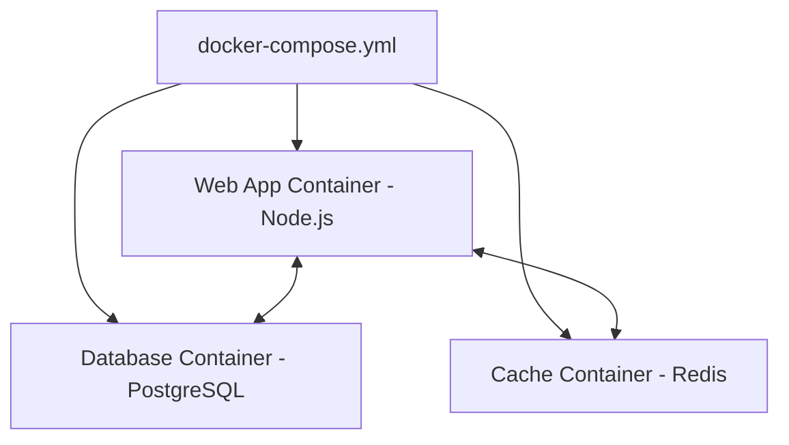

import { Aside } from "@astrojs/starlight/components";

<Aside title="💡 ရည်ရွယ်ချက်">
  Web Application, Database, In-memory Cache (Redis) စသည့် Multi-container စနစ်များကို `docker-compose.yml` File တစ်ခုတည်းဖြင့် စနစ်တကျ ချိတ်ဆက် ရန်းယူရန် ဖြစ်ပါတယ်။
</Aside>

## Docker Compose ဆိုတာ ဘာလဲ?

**Docker Compose** ဆိုသည်မှာ Containers အများအပြား ပါဝင်သော Application တစ်ခုလုံးကို Configuration File (`docker-compose.yml`) တစ်ခုတည်း ဖြင့် တည်ဆောက်၊ မောင်းနှင်၊ ထိန်းချုပ်ပေးသော Tool ဖြစ်ပါတယ်။



---

## 1. Real-world `docker-compose.yml` ဥပမာ (Web + Database + Redis)

```yaml
version: '3.8'

services:
  # 1. Web Application Service
  web:
    build: .
    ports:
      - "3000:3000"
    environment:
      - NODE_ENV=production
      - DATABASE_URL=postgres://postgres:secretpassword@db:5432/mydb
      - REDIS_URL=redis://cache:6379
    depends_on:
      - db
      - cache

  # 2. Database Service
  db:
    image: postgres:15-alpine
    restart: always
    environment:
      POSTGRES_USER: postgres
      POSTGRES_PASSWORD: secretpassword
      POSTGRES_DB: mydb
    volumes:
      - pgdata:/var/lib/postgresql/data

  # 3. Redis Cache Service
  cache:
    image: redis:alpine
    restart: always

# Volumes သီးသန့် Persist လုပ်ခြင်း
volumes:
  pgdata:
```

---

## 2. Docker Compose CLI Commands

```bash
# Services အားလုံးကို Background တွင် စတင် ရန်းယူခြင်း
docker compose up -d

# Services အားလုံး၏ Logs ကြည့်ခြင်း
docker compose logs -f

# Services အားလုံး၏ အခြေအနေ ကြည့်ခြင်း
docker compose ps

# Services အားလုံးကို ရပ်တန့်၍ Containers များကို ဖျက်ပစ်ခြင်း
docker compose down

# Data Volumes ပါ အကုန် ရှင်းထုတ်ခြင်း
docker compose down -v
```

---

## 3. Docker Networking & Environment Variables

- **Docker Internal Network:** Compose ဖြင့် Run သော Containers များသည် သီးသန့် Internal Network တွင် ပါဝင်ပြီး Service Name ဖြင့် အချင်းချင်း Direct Domain ခေါ်ယူနိုင်သည် (ဥပမာ - `db:5432` သို့မဟုတ် `cache:6379`)။
- **Environment Variables File:** Secrets များကို `.env` File ထဲတွင် သီးသန့် ခွဲထုတ်ထားပြီး `docker-compose.yml` မှ လှမ်းယူ သုံးစွဲနိုင်ပါတယ်။
