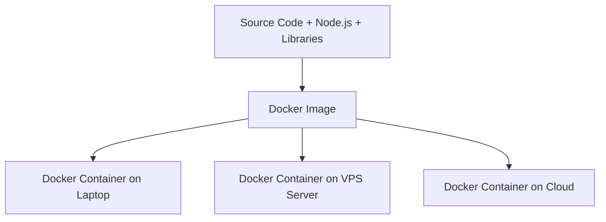

import { Aside } from "@astrojs/starlight/components";

<Aside title="💡 ရည်ရွယ်ချက်">
  "Works on my machine" (ငါ့စက်ထဲမှာတော့ အလုပ်လုပ်တယ်) ဟူသော ပြဿနာကို ဖြေရှင်းပေးသည့် **Docker** နှင့် **Containerization Technology** ၏ အခြေခံ သဘောတရားများကို နားလည်စေရန် ဖြစ်ပါတယ်။
</Aside>

## "Works on my Machine" ပြဿနာ

Developer တိုင်း ကြုံတွေ့ရလေ့ရှိသော ပြဿနာတစ်ခု ရှိပါတယ်:

၁။ ခင်ဗျား၏ Laptop ထဲတွင် Code ရေးဆွဲစဉ် အရာရာတိုင်း ချောမွေ့စွာ အလုပ်လုပ်နေသည်။
၂။ Server (သို့မဟုတ်) အခြား Developer ၏ စက်ထဲသို့ Code ရွှေ့လိုက်သောအခါ Node version မတူခြင်း၊ Dependency မကိုက်ညီခြင်း သို့မဟုတ် OS Environment ပြဿနာများကြောင့် Error တက်သွားသည်။

**Docker** သည် ဤပြဿနာကို **Containerization** နည်းပညာဖြင့် အပြည့်အဝ ဖြေရှင်းပေးပါတယ်။

---

## Docker ဆိုတာ ဘာလဲ?

**Docker** ဆိုသည်မှာ Application တစ်ခုနှင့် ၎င်း အလုပ်လုပ်ရန် လိုအပ်သော Environment (Code, Runtime, Libraries, Dependencies, System Tools) အားလုံးကို **Container** ဟုခေါ်သော သီးသန့် အလုံပိတ် အထုပ်ငယ်လေးအဖြစ် ထုပ်ပိုးပေးသည့် Open-source Platform ဖြစ်ပါတယ်။

---

## Containers vs Virtual Machines (VMs)

| အင်္ဂါရပ် | Containers (Docker) | Virtual Machines (VMware / VirtualBox) |
|---|---|---|
| **Architecture** | Host OS ၏ Kernel ကို မျှဝေသုံးစွဲသည် (Lightweight) | VM တိုင်းတွင် Guest OS သီးသန့် ပါဝင်သည် (Heavyweight) |
| **Boot Time** | စက္ကန့်ပိုင်းအတွင်း (Instant) | မိနစ်ပိုင်းကြာမြင့်သည် |
| **Resource Consumed** | MB အနည်းငယ်သာ သုံးစွဲသည် | GB ပေါင်းများစွာ သုံးစွဲရသည် |
| **Performance** | Native Performance နီးပါး မြန်ဆန်သည် | Hypervisor ကြောင့် Performance အနည်းငယ် ကျဆင်းသည် |

---

## Docker ရဲ့ အဓိက အားသာချက် ၃ ခု

1. **Consistency (ညီညွတ်မှု):** Developer ၏ စက်တွင် run သော Container သည် Staging နှင့် Production Server ပေါ်တွင် ၁၀၀% တူညီစွာ အလုပ်လုပ်သည်။
2. **Isolation (သီးခြား ကင်းလွတ်မှု):** Container တစ်ခုအတွင်း ဖြစ်ပေါ်သော Error သည် အခြား Container များ သို့မဟုတ် Host OS ကို ထိခိုက်မှု မရှိပါ။
3. **Efficiency (ထိရောက်မှု):** Resource သုံးစွဲမှု အလွန် နည်းပါးသဖြင့် Server တစ်ခုတည်းတွင် Containers များစွာ ပြိုင်တူ Run နိုင်သည်။
