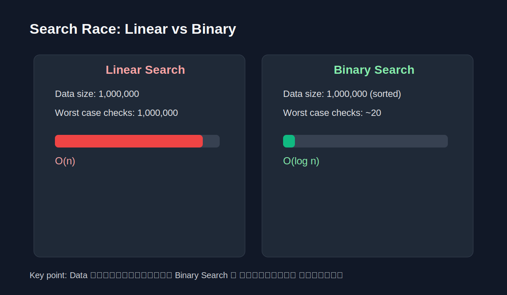
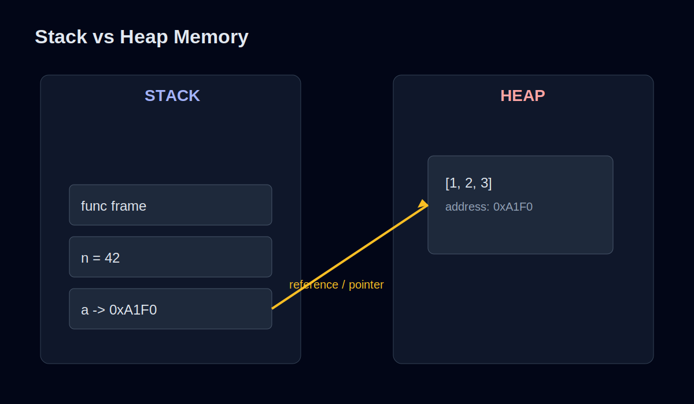

import { Aside } from "@astrojs/starlight/components";

## The "Big O" Made Simple

Programmer တိုင်း ပါးစပ်ဖျားမှာ ရေပန်းစားတဲ့ **Big O Notation** ဆိုတာ ဘာကြီးလဲ?
ရိုးရိုးလေး ပြောရရင် **"Data တွေ များလာရင် ငါ့ Code က ဘယ်လောက် ပိုနှေးသွားမလဲ?"** ဆိုတာကို တိုင်းတာတဲ့ ပေတံ တစ်ခုပါပဲ။

### Time vs. Space Complexity
Code ကောင်း တစ်ပုဒ်ဖြစ်ဖို့ အချက် (၂) ချက်နဲ့ တိုင်းတာပါတယ်-
1.  **Time Complexity:** ဘယ်လောက် ကြာမလဲ? (Speed)
2.  **Space Complexity:** Memory ဘယ်လောက် စားမလဲ? (Storage)

### ဇွတ်လုပ်နည်း vs. ပညာသားပါနည်း ($O(n^2)$ vs $O(\log n)$)

ဥပမာ - စာအုပ်ပုံကြီး တစ်ပုံထဲမှာ စာအုပ်တစ်အုပ် ရှာချင်တယ် ဆိုပါစို့။

-   **Brute Force ($O(n)$):** စာအုပ် တစ်အုပ်ချင်းစီ လိုက်ကြည့်မယ်။ စာအုပ် ၁၀၀ ရှိရင် အကြိမ် ၁၀၀ လိုက်ရှာရနိုင်တယ်။
-   **Optimized ($O(\log n)$):** စာအုပ်တွေကို အက္ခရာစဉ်နဲ့ စီထားမယ်ဆိုရင်၊ ထက်ဝက်စီ ဖယ်ထုတ်ပြီး ရှာလို့ရတယ်။ အများကြီး ပိုမြန်သွားမယ်။

<Aside type="danger" title="Why O(n^2) is the enemy?">
Loop နှစ်ထပ် (Nested Loop) ပတ်ထားတဲ့ Code မျိုးဆိုရင် Data နည်းနည်းတိုးတာနဲ့ ကြာချိန်က အဆမတန် တက်လာတတ်တယ်။ User တွေ စောင့်ရတာ စိတ်မရှည်တော့ဘူးဆိုရင် ဒါဟာ ပြဿနာပဲ။
</Aside>

### Activity: Race!
1,000,000 Data ရှိတဲ့ Array တစ်ခုထဲမှာ `x` ပါလား ရှာကြည့်တဲ့အခါ Linear Search (တစ်လုံးချင်းရှာ) နဲ့ Binary Search (ထက်ဝက်ချိုးရှာ) တို့ရဲ့ ကွာခြားချက်ကို လက်တွေ့ စမ်းသပ်ကြည့်သင့်ပါတယ်။

---

## Memory Management 101

ကျွန်တော်တို့ ဖန်တီးလိုက်တဲ့ Variable တွေ၊ Object တွေက ကွန်ပျူတာရဲ့ ဘယ်နားမှာ သွားနေလဲ?

### Stack vs. Heap
Memory မှာ အဓိက (၂) နေရာရှိတယ်။

1.  **Stack:**
    -   စနစ်ကျတယ်။ တစ်ခုပြီးမှ တစ်ခု ထပ်စီထားသလိုပဲ။
    -   Function ခေါ်တဲ့အခါသုံးတယ်။ မြန်တယ်။
    -   Size သေးတယ်။

2.  **Heap:**
    -   မောင်ပိုင်စီးထားတဲ့ နေရာလွတ်ကြီးလိုပဲ။
    -   Object တွေ၊ Array အကြီးကြီးတွေ ဒီမှာသိမ်းတယ်။
    -   Stack လောက် မမြန်ဘူး။ ဒါပေမယ့် နေရာအများကြီးရတယ်။

### Pointers Explained
**Pointer** ဆိုတာ လိပ်စာကတ်ပြားလေး တစ်ခုပါပဲ။
`var a = [1, 2, 3]` လို့ ကြေညာလိုက်ရင် `a` ဆိုတဲ့ နာမည်က Stack ပေါ်မှာ ရှိမယ်။ တကယ့် Data `[1, 2, 3]` က Heap ပေါ်မှာ ရှိမယ်။ `a` က Heap ပေါ်က လိပ်စာကိုပဲ ညွှန်ပြ (Point) ပေးထားတာပါ။

<Aside title="Visual Analogy">
အိမ် (Data) နဲ့ အိမ်လိပ်စာ (Pointer) လိုပါပဲ။ သူငယ်ချင်းကို အိမ်လိပ်စာ ပေးလိုက်လို့ သူငယ်ချင်းက အိမ်ကြီးကို မ, ပြီး ယူသွားတာ မဟုတ်ပါဘူး။ လိပ်စာအတိုင်း လာလည်တာပဲ ဖြစ်ပါတယ်။
</Aside>

### Image/Diagram Suggestion
- Big O Growth Chart: $O(1), O(\log n), O(n), O(n^2)$ ကို မျဉ်းကွေးနဲ့ ယှဉ်ပြတဲ့ graph
- Stack vs Heap Memory Map: Stack ဘက်၊ Heap ဘက် box တွေခွဲပြီး variable/reference/data ကို arrow နဲ့ ဆက်ပြထားတဲ့ diagram
- Search Race Visual: Linear Search vs Binary Search ကို step count နဲ့ side-by-side နှိုင်းယှဉ်ပုံ
