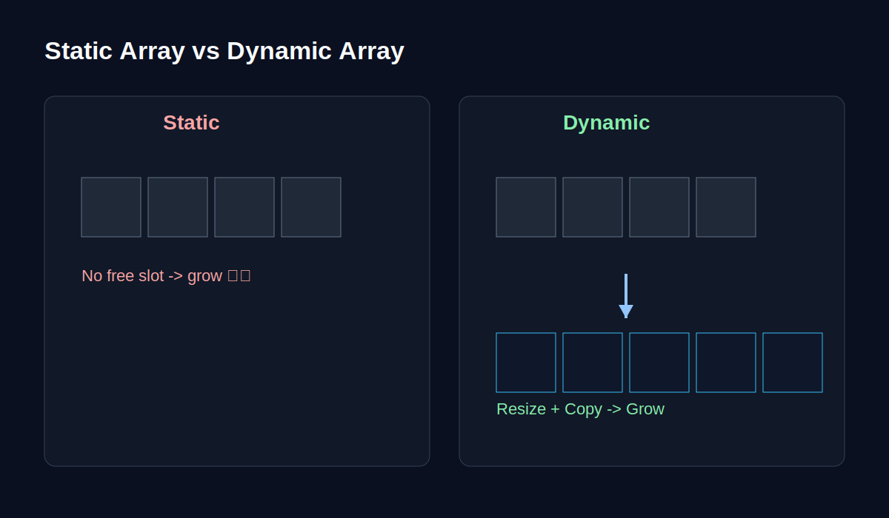

import { Aside } from "@astrojs/starlight/components";

## Arrays: The Basics

Array ဆိုတာ အတန်းလိုက် စီထားတဲ့ သေတ္တာလေးတွေ နဲ့ တူပါတယ်။ သေတ္တာတစ်လုံးချင်းစီမှာ နံပါတ် (Index) ရှိတယ်။
`arr[0]` ဆိုရင် ပထမဆုံး သေတ္တာ၊ `arr[1]` ဆိုရင် ဒုတိယ သေတ္တာ စသဖြင့်ပေါ့။

### Static vs. Dynamic Arrays

-   **Static Array:**
    -   အရွယ်အစား (Size) ကို ကြိုသတ်မှတ်ရတယ်။
    -   ဥပမာ - ထိုင်ခုံ ၁၀ လုံးပါတဲ့ ကားတစ်စီးလိုပဲ။ လူ ၁၁ ယောက် တင်လို့မရဘူး။
    
-   **Dynamic Array (e.g., Python List, JS Array):**
    -   Size က အလိုအလျောက် ကြီးလာနိုင်တယ်။
    -   အခန်းပြည့်သွားရင် သူက နောက်ထပ် အခန်းလွတ် ပိုများတဲ့ နေရာအသစ်ကို ရွှေ့ပြီး Data တွေ အကုန် ကူးထည့်လိုက်တယ်။ (Resize)

<Aside title="Under the hood">
Dynamic Array ပြည့်သွားတဲ့အခါ အသစ်နေရာချဖို့ (Allocation) နဲ့ ကူးပြောင်းဖို့ (Copying) အချိန်နည်းနည်း ပေးရပါတယ်။ ဒါပေမယ့် ပုံမှန်သုံးနေတဲ့အချိန်မှာတော့ အရမ်းမြန်ပါတယ်။
</Aside>

### Real World Use: Building a Todo List
Todo List တစ်ခုကို စဉ်းစားကြည့်ပါ။
1.  Assignment လုပ်ရန် (Add)
2.  Gym သွားရန် (Add)
3.  Assignment ပြီးပြီ (Delete/Mark done)

ဒီလို အစီအစဉ်တကျ သိမ်းဖို့ Array က အသင့်တော်ဆုံးပါပဲ။ Index နဲ့ တန်းခေါ်သုံးလို့ရတဲ့အတွက် Access လုပ်တာ အရမ်းမြန် ($O(1)$) ပါတယ်။

---

### Image/Diagram Suggestion
- Static vs Dynamic Array: fixed box count နဲ့ expandable box count ကို တိုက်ရိုက်ယှဉ်ပြထားတဲ့ ပုံ
- Resize Animation Frames: array ပြည့်သွားပြီး new memory block ထဲ copy လုပ်သွားတဲ့ step-by-step diagram
- Todo List UI Mockup: Add / Complete / Delete action တွေကို array operations နဲ့ mapping ပြထားတဲ့ visual
