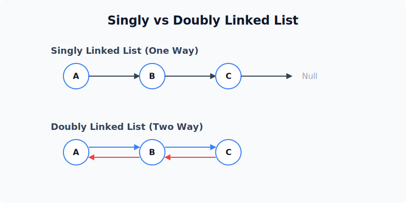
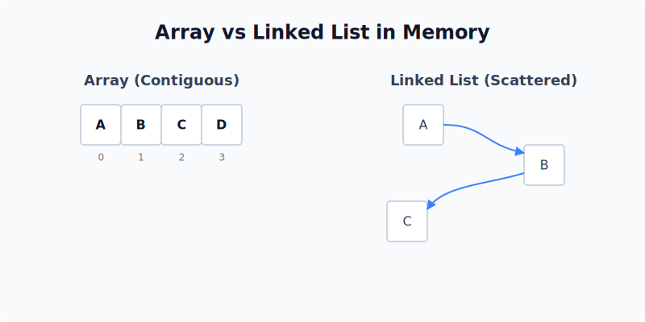
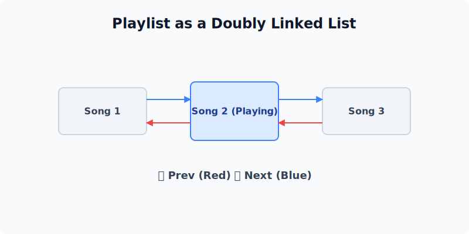

import { Aside } from "@astrojs/starlight/components";

## Linked Lists

Array နဲ့ မတူတာက Linked List က Memory မှာ တစ်ဆက်တည်း ရှိမနေပါဘူး။
နေရာအနှံ့ ကြဲဖြန့်နေနိုင်တယ်။ တစ်ခုနဲ့ တစ်ခု **Link (ချိတ်ဆက်မှု)** လေးတွေနဲ့ ဆွဲထားကြတာပါ။

### Visual Analogy: A Scavenger Hunt

Array က စာအုပ်စင်တစ်ခုလို တစ်စုတစ်စည်းတည်း ရှိတယ်။
Linked List ကတော့ "ရတနာသိုက်ရှာပုံတော်" (Scavenger Hunt) နဲ့ တူပါတယ် -
- ပထမ သဲလွန်စကို တွေ့မယ်။
- အဲ့ဒီ သဲလွန်စက ဒုတိယ နေရာကို ညွှန်ပြမယ်။
- ဒုတိယ နေရာရောက်မှ တတိယ နေရာကို သိမယ်။

### Singly vs. Doubly Linked Lists

1. **Singly Linked List:**
   - ရှေ့ကိုပဲ သွားလို့ရမယ်။ (Head -> Next -> Next -> Null)
   - နောက်ပြန် လှည့်လို့ မရဘူး။
2. **Doubly Linked List:**
   - ရှေ့ရော နောက်ရော သွားလို့ရမယ်။ (`Prev -> Node -> Next` ကို နှစ်ဖက်လုံး ပြန်သွားလို့ ရတဲ့ သဘော)
   - Memory ပိုစားမယ် (Pointers နှစ်ခု မှတ်ရလို့)။

### Project: Music Playlist

သီချင်း Playlist တစ်ခု တည်ဆောက်မယ်ဆိုပါစို့ -
- **Playing Now:** လက်ရှိ Node
- **Next/Skip:** `Next` Pointer ကို သွားမယ်။
- **Previous:** `Prev` Pointer ကို သွားမယ်။
- **Add Song:** ကြိုက်တဲ့နေရာမှာ ကြားဖြတ်ထည့်ဖို့ Array ထက် ပိုလွယ်တယ်။ Pointer လေး ပြောင်းချိတ်လိုက်ရုံပါပဲ။

<Aside title="Pros & Cons">
- **Good:** Insert/Delete (နေရာသိရင်) အရမ်းမြန်တယ်။ Size အရှင် (Dynamic) ဖြစ်တယ်။
- **Bad:** Random Access မရဘူး။ `arr[50]` လို တန်းခေါ်လို့မရဘဲ၊ ထိပ်ဆုံးကနေ အကြိမ် ၅၀ မြောက်အထိ တစ်ဆင့်ချင်း သွားရတယ်။
</Aside>
