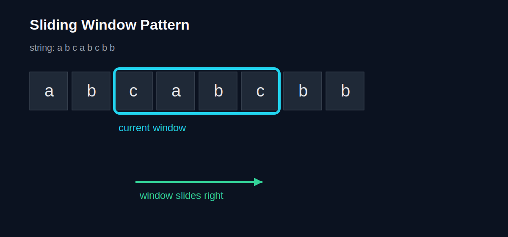

import { Aside } from "@astrojs/starlight/components";

## Strings: More than just text

String ဆိုတာ တကယ်တော့ Character တွေ စီထားတဲ့ Array တစ်ခုပါပဲ။
`"Hello"` ဆိုတာ `['H', 'e', 'l', 'l', 'o']` နဲ့ သဘောတရား တူပါတယ်။

### Immutability vs. Mutability
-   **Immutable:** ပြောင်းလဲလို့ မရဘူး။ ပြင်ချင်ရင် အသစ်တစ်ခု ဖန်တီးရတယ်။ (ဥပမာ - Python Strings, Java Strings)
-   **Mutable:** တိုက်ရိုက် ပြင်လို့ရတယ်။ (ဥပမာ - C++ Strings)

### Pattern 1: The "Two Pointer" Technique
Array သို့မဟုတ် String တစ်ခုကို ဘယ်နဲ့ ညာ၊ ဒါမှမဟုတ် ရှေ့နဲ့ နောက် ကနေ Pointer နှစ်ခု အသုံးပြုပြီး ဖြေရှင်းတဲ့ နည်းလမ်းပါ။

**ဥပမာ - Palindrome စစ်ခြင်း (ရှေ့ဖတ် နောက်ဖတ် အတူတူပဲလား?)**
`"level"`
1.  ဘယ်ဘက် Pointer က 'l'၊ ညာဘက် Pointer က 'l' -> တူတယ် -> ရှေ့ဆက်တိုး။
2.  ဘယ် 'e'၊ ညာ 'e' -> တူတယ် -> ရှေ့ဆက်တိုး။
3.  လယ်က 'v' -> ပြီးပြီ။ Palindrome ဖြစ်တယ်။

### Pattern 2: The "Sliding Window" Technique
ပြတင်းပေါက် (Window) တစ်ခုကနေ ကြည့်သလိုမျိုး၊ Data အစုလိုက် (Subarray/Substring) ကို ရွှေ့ပြီး တွက်ချက်တဲ့ နည်းလမ်းပါ။

**ဥပမာ - အရှည်ဆုံး စာသားကို ရှာမယ် (ထပ်နေတာ မပါစေရ)**
`abcabcbb`
Window လေး တစ်ဆင့်ချင်း ရွှေ့သွားရင်း Window ထဲမှာ ရှိတဲ့ စာလုံးတွေကို မှတ်သားသွားမယ့် နည်းလမ်း ဖြစ်ပါတယ်။ Nested Loop သုံးတာထက် အများကြီး ပိုမြန် ($O(n)$) ပါတယ်။

### Image/Diagram Suggestion
- Two Pointer Walkthrough: ဘယ် pointer နဲ့ ညာ pointer ဘယ်လိုရွှေ့သွားလဲ arrows နဲ့ပြထားတဲ့ sequence diagram
- Sliding Window Frames: window size တူတူထားပြီး index လိုက် ရွှေ့သွားတဲ့ frame-by-frame visual
- Palindrome Mirror Visual: string ကို အလယ်ဗဟိုကနေ mirror အဖြစ်ပြတဲ့ image
