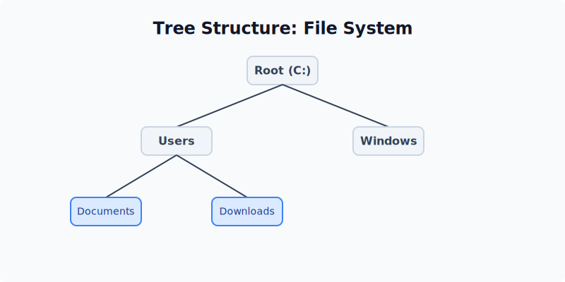
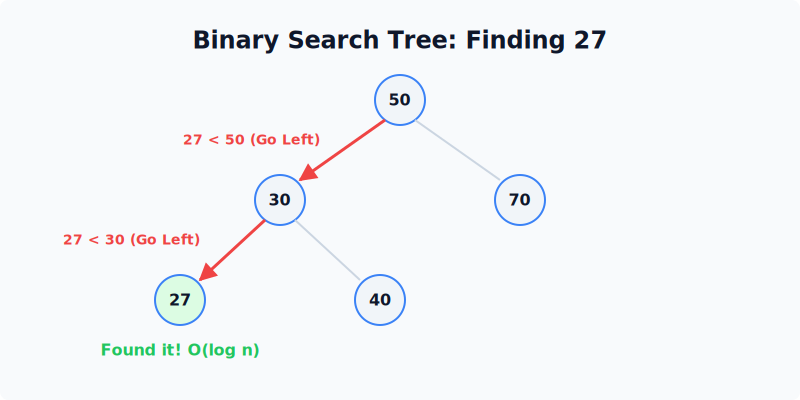
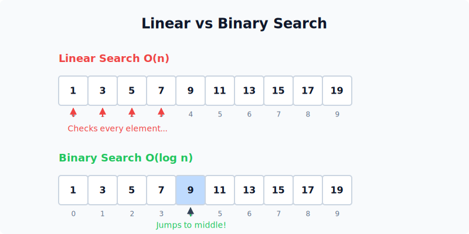

import { Aside } from "@astrojs/starlight/components";

## Trees

Folder Structure ဆိုတာကို မြင်ဖူးတယ်မလား?
- Folder တစ်ခုထဲမှာ Sub-folders တွေ ရှိနိုင်တယ်။
- Files တွေလည်း ရှိနိုင်တယ်။
- Root Folder (အဓိက ဖိုင်တွဲ) က တစ်ခုတည်း။

ဒါကို **Tree** လို့ ခေါ်ပါတယ်။ "အမြစ်" (Root) က အပေါ်ဆုံးမှာ ဖြစ်ပြီး၊ "ခက်နွယ်" (Branches) တွေက အောက်ကို ဖြာထွက်သွားတာပါ။ (Tree ပြောင်းပြန်စိုက်ထားတဲ့ ပုံစံပေါ့။)
Node တိုင်းမှာ **Parent** တစ်ခုပဲ ရှိတတ်ပြီး၊ **Children** အများကြီး ရှိနိုင်ပါတယ်။

### Binary Search Trees (BST)

ဒါကတော့ Tree ထဲမှာမှ အထူးခြားဆုံး ပုံစံပါ။
Node တစ်ခုမှာ အများဆုံး ကလေး (၂) ယောက်ပဲ ရှိနိုင်မယ် -

1. ဘယ်ဘက် Node က Parent ထက် **ငယ်ရမယ်**။
2. ညာဘက် Node က Parent ထက် **ကြီးရမယ်**။

ဒါကြောင့် ဘယ်ဘက်သွားရင် ငယ်သွားမယ်၊ ညာဘက်သွားရင် ကြီးသွားမယ် ဆိုတာကို သိနေပါတယ်။

### Why Faster than Array? $O(\log n)$

Array ထဲမှာ 50 ကို ရှာရင် 1 ကနေ 100 အထိ တစ်ခုချင်း ကြည့်ရမယ်။
BST မှာတော့ ကလေးကစားသလိုပါပဲ -
- Root က 50 လား? ဟုတ်ရင် တွေ့ပြီ။
- Root ထက် ငယ်ရင် ဘယ်ဘက်ကို ဆက်သွား။
- Root ထက် ကြီးရင် ညာဘက်ကို ဆက်သွား။

တစ်ခါမေးတိုင်း Data တွေက တစ်ဝက် (Half) လျော့သွားတဲ့အတွက် Array ထက် အဆပေါင်းများစွာ မြန်ပါတယ်။

## Visual Guides

