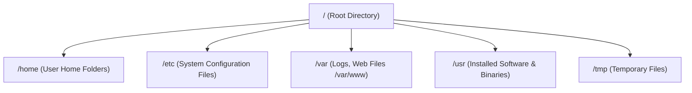

import { Aside } from "@astrojs/starlight/components";
import Quiz from "../../../../components/mdx/Quiz";
import LessonCompletion from "../../../../components/mdx/LessonCompletion";

<Aside title="💡 ရည်ရွယ်ချက်">
  Cloud Server (VPS) များ၊ Docker Containers များနှင့် Production Backend စနစ်များသည် **Linux Operating System (Ubuntu / Debian)** ပေါ်တွင် ၉၀% ကျော် အလုပ်လုပ်ကြပါတယ်။ ဤသင်ခန်းစာတွင် Linux Terminal ကို ကျွမ်းကျင်စွာ အသုံးပြု၍ လမ်းကြောင်းရှာဖွေခြင်း၊ ဖိုင်များ ဖန်တီး/ပြင်ဆင်/ဖျက်ပစ်ခြင်းများကို လက်တွေ့ လေ့လာသွားပါမည်။
</Aside>

## Linux Directory Structure (သစ်ပင်သဖွယ် ဖိုင်စနစ်)

Windows တွင် `C:\` သို့မဟုတ် `D:\` Drive များဖြင့် စတင်လေ့ရှိသော်လည်း Linux တွင်မူ အရာအားလုံးသည် **Root Directory (`/`)** ဟုခေါ်သော အရင်းအမြစ်တစ်ခုတည်းမှ ဖြာထွက်ပါတယ်။



### အရေးကြီးသော အဓိက လမ်းကြောင်းများ (Key Directories):
1. **`/` (Root):** Linux စနစ်တစ်ခုလုံး၏ အမြင့်ဆုံး မူလလမ်းကြောင်း။
2. **`/home/username`:** မိမိ User ၏ သီးသန့် Personal Files များ၊ Projects များ သိမ်းဆည်းရာ နေရာ (Shortcut အနေဖြင့် `~` ဟု ရေးနိုင်ပါသည်)။
3. **`/etc`:** Nginx, SSH, Firewall အစရှိသော System Configurations များ အားလုံး တည်ရှိရာ နေရာ။
4. **`/var/log` & `/var/www`:** Server ၏ Log ဖိုင်များနှင့် Website Production Files များ တည်ရှိရာ နေရာ။

---

## မရှိမဖြစ် Navigation Commands (လမ်းကြောင်း ရှာဖွေခြင်း)

Terminal ဖွင့်လိုက်သည်နှင့် လက်ရှိ မိမိ ရောက်ရှိနေသော နေရာကို သိရှိရန်နှင့် အခြား Folder များသို့ ကူးပြောင်းရန် အောက်ပါ Commands များကို သုံးပါတယ်:

### ၁။ `pwd` (Print Working Directory)
လက်ရှိ ရောက်ရှိနေသော လမ်းကြောင်းအပြည့်အစုံကို ပြသပေးပါတယ်။
```bash
pwd
# Output: /home/ubuntu
```

### ၂။ `ls` (List Files)
လက်ရှိ Folder အတွင်းရှိ ဖိုင်များနှင့် Folder များကို ကြည့်ရှုခြင်း:
```bash
# သာမန် ဖိုင်များ ကြည့်ခြင်း
ls

# ဖိုင် permissions, ပိုင်ရှင်, အရွယ်အစား အပြည့်အစုံ ကြည့်ခြင်း (Long format)
ls -l

# Hidden files (အစက် . ဖြင့်စသော ဖိုင်များ e.g. .env, .bashrc) ပါ အကုန်ကြည့်ခြင်း
ls -la

# ဖိုင်အရွယ်အစားကို ဖတ်ရလွယ်သော MB, GB ဖြင့် ပြခြင်း (Human-readable)
ls -lh
```

### ၃။ `cd` (Change Directory)
လမ်းကြောင်း ပြောင်းရွှေ့ခြင်း:
```bash
# /var/www လမ်းကြောင်းသို့ သွားမည်
cd /var/www

# တစ်ဆင့် အထက် Folder သို့ ပြန်တက်မည် (Parent directory)
cd ..

# နှစ်ဆင့် အထက်သို့ ပြန်တက်မည်
cd ../..

# မိမိ Home Directory သို့ တိုက်ရိုက် ပြန်သွားမည်
cd ~
# သို့မဟုတ် cd တစ်လုံးတည်း ရိုက်ပါ
cd
```

---

## File & Folder စီမံခန့်ခွဲခြင်း Commands

### ၁။ Folder အသစ် ဖန်တီးခြင်း (`mkdir`)
```bash
# my-app အမည်ရှိ folder ဆောက်ခြင်း
mkdir my-app

# Parent folder မရှိသေးပါက တစ်ခါတည်း ဆက်တိုက် ဆောက်ပေးခြင်း (-p flag)
mkdir -p /var/www/html/my-project/assets
```

### ၂။ File အလွတ် ဖန်တီးခြင်း (`touch`)
```bash
touch server.js .env config.json
```

### ၃။ File ကူးယူခြင်း (`cp`)
```bash
# server.js ကို server.backup.js အဖြစ် copy ကူးမည်
cp server.js server.backup.js

# Folder တစ်ခုလုံးကို အတွင်းရှိ ဖိုင်များအပါ copy ကူးလိုပါက -r (recursive) သုံးပါ
cp -r my-app my-app-backup
```

### ၄။ File ရွှေ့ပြောင်းခြင်းနှင့် အမည်ပြောင်းခြင်း (`mv`)
```bash
# အမည်ပြောင်းခြင်း (Rename)
mv old-name.js new-name.js

# ဖိုင်ကို အခြား Folder သို့ ရွှေ့ခြင်း
mv server.js /var/www/html/
```

### ၅။ File နှင့် Folder ဖျက်ပစ်ခြင်း (`rm`)

<Aside type="caution" title="⚠️ သတိပြုရန်">
  Linux Terminal တွင် ဖျက်လိုက်သော ဖိုင်များသည် Windows ၏ Recycle Bin ကဲ့သို့ ပြန်ဆယ်၍ မရပါ။ ထို့ကြောင့် `rm` ကို သုံးသည့်အခါ လမ်းကြောင်း မှန်မမှန် အထူး သတိပြုပါ။
</Aside>

```bash
# ဖိုင်တစ်ခုတည်း ဖျက်ခြင်း
rm test.txt

# Folder တစ်ခုလုံးကို အတင်းအကျပ် အကုန်ဖျက်ပစ်ခြင်း (-rf)
rm -rf old-project/
```

---

## File များအတွင်း ရှာဖွေခြင်းနှင့် ဖတ်ရှုခြင်း (`cat`, `less`, `grep`, `tail`)

### ၁။ `cat` & `less` (ဖိုင်အကြောင်းအရာ ဖတ်ခြင်း)
```bash
# ဖိုင်တစ်ခုလုံး၏ စာများကို မျက်နှာပြင်ပေါ် ချက်ချင်း အကုန်ထုတ်ပြခြင်း
cat /etc/nginx/nginx.conf

# စာမျက်နှာ ရှည်လျားသော ဖိုင်များကို Scroll ဆွဲ၍ အေးဆေး ဖတ်ခြင်း (ထွက်လိုပါက 'q' နှိပ်ပါ)
less app.log
```

### ၂။ `tail -f` (Real-time Live Log ကြည့်ခြင်း)
Server စောင့်ကြည့်ရာတွင် အသုံးအများဆုံး Command ဖြစ်ပြီး၊ အသစ်ဝင်လာသော Log စာကြောင်းများကို မျက်ခြည်မပြတ် စောင့်ကြည့်နိုင်ပါတယ်:
```bash
# Nginx Error Logs များကို Live စောင့်ကြည့်မည်
tail -f /var/log/nginx/error.log
```

### ၃။ `grep` (စာလုံး ရှာဖွေခြင်း)
ဖိုင်များထဲမှ သီးသန့် စာလုံးပါသော လိုင်းများကို စစ်ထုတ် ရှာဖွေခြင်း:
```bash
# app.log ထဲမှ "ERROR" သို့မဟုတ် "500" ပါသော လိုင်းများကို ရှာမည်
grep "ERROR" app.log

# Case-insensitive (အကြီးအသေး မခွဲခြားဘဲ ရှာမည် -i)
grep -i "database" config.env
```

---

## Terminal Text Editor (`nano`) ဖြင့် ဖိုင်ပြင်ဆင်ခြင်း

Server ပေါ်တွင် VS Code မရှိသည့်အခါ Terminal အတွင်း တိုက်ရိုက် ဖိုင်ပြင်ရန် အလွယ်ကူဆုံး Editor မှာ **`nano`** ဖြစ်ပါတယ်:

```bash
nano /etc/nginx/nginx.conf
```

### အသုံးဝင်သော `nano` Shortcuts:
- **`Ctrl + O`** ပြီးလျှင် `Enter` : ဖိုင်ကို Save လုပ်ခြင်း (Write Out)
- **`Ctrl + X`** : nano မှ ထွက်ခြင်း (Exit)
- **`Ctrl + W`** : စာလုံး ရှာဖွေခြင်း (Where is)
- **`Ctrl + K`** : လက်ရှိ စာတစ်ကြောင်းလုံးကို ဖြတ်ပစ်ခြင်း (Cut)

---

## 🎯 လက်တွေ့ လေ့ကျင့်ခန်း Checklist

- [ ] `pwd` ရိုက်ပြီး မိမိ လက်ရှိ ရောက်နေသည့် နေရာကို စစ်ဆေးပါ။
- [ ] `mkdir -p ~/projects/my-server` ဖြင့် folder တစ်ခု တည်ဆောက်ပါ။
- [ ] `cd ~/projects/my-server` ထဲသို့ ဝင်ပါ။
- [ ] `nano app.js` ဖြင့် `console.log("Hello Linux Server");` ဟု ရေးပြီး `Ctrl+O` ဖြင့် Save လုပ်ပါ။
- [ ] `cat app.js` ဖြင့် ရေးထားသော Code ကို ပြန်လည် စစ်ဆေးပါ။

## 🧠 အသိပညာ စစ်ဆေးမှု (Quiz)

<Quiz
  client:idle
  title="Linux Navigation & Files စစ်ဆေးမှု"
  questions={[
    {
      id: "q1",
      question: "Linux တွင် .env ကဲ့သို့သော အစက် (.) ဖြင့် စတင်သည့် Hidden Files များကို ကြည့်ရှုလိုပါက မည်သည့် command flag ကို သုံးရမည်နည်း?",
      options: [
        "ls -h",
        "ls -a (သို့မဟုတ်) ls -la",
        "ls -s",
        "ls -r"
      ],
      correctAnswer: 1,
      explanation: "-a (all) flag သည် အစက် (.) ဖြင့် စတင်သော hidden files များကိုပါ ထုတ်ပြပေးပြီး၊ -la သည် အသေးစိတ် permissions များနှင့်အတူ ပြသပေးပါသည်။"
    },
    {
      id: "q2",
      question: "Production Server ပေါ်တွင် အသစ်တက်လာသော Error Logs များကို Real-time မျက်ခြည်မပြတ် စောင့်ကြည့်ရန် မည်သည့် command ကို သုံးသင့်သနည်း?",
      options: [
        "cat error.log",
        "nano error.log",
        "tail -f error.log",
        "grep error.log"
      ],
      correctAnswer: 2,
      explanation: "tail -f (-f ဆိုသည်မှာ follow) သည် ဖိုင်ထဲသို့ Log စာကြောင်းအသစ်များ ရောက်ရှိလာတိုင်း Terminal တွင် အလိုအလျောက် တိုက်ရိုက် ထုတ်ပြပေးပါသည်။"
    }
  ]}
/>

<LessonCompletion
  client:idle
  lessonId="linux-devops-01-navigation"
  lessonTitle="Navigation and Files"
/>
