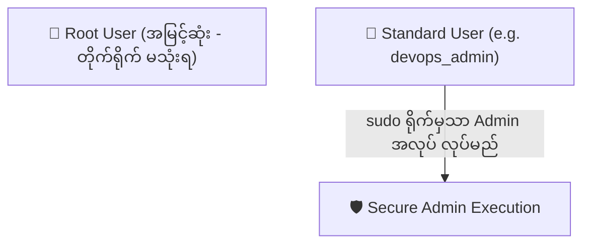

import { Aside } from "@astrojs/starlight/components";
import Quiz from "../../../../components/mdx/Quiz";
import LessonCompletion from "../../../../components/mdx/LessonCompletion";

<Aside title="💡 ရည်ရွယ်ချက်">
  Linux Server တွင် လုံခြုံရေးသည် အရေးအကြီးဆုံး ဖြစ်ပါတယ်။ မည်သည့် User သည် မည်သည့် File ကို ဖတ်ခွင့် (Read)၊ ပြင်ခွင့် (Write) သို့မဟုတ် Run ခွင့် (Execute) ရှိသည်ကို စနစ်တကျ သတ်မှတ်နိုင်ရန် **Permissions (`chmod`, `chown`)** နှင့် **User Management (`sudo`)** ကို နားလည်ရပါမည်။
</Aside>

## Linux Permissions Matrix (rwx သဘောတရား)

Terminal တွင် `ls -l` ဟု ရိုက်ကြည့်ပါက ဖိုင်တစ်ခုချင်းစီ၏ ရှေ့တွင် `-rwxr-xr--` ကဲ့သို့သော စာလုံး ၁၀ လုံးကို တွေ့ရပါမည်:

```bash
ls -l
# Output:
# -rwxr-xr-- 1 ubuntu www-data 4096 Aug 14 10:00 server.js
```

ဤစာလုံး ၁၀ လုံးကို အပိုင်း ၄ ပိုင်း ခွဲခြားနားလည်နိုင်ပါတယ်:


1. **File Type (ပထမစာလုံး):**
   - `-` : ပုံမှန် File
   - `d` : Directory (Folder)
2. **Owner Permissions (စာလုံး ၂ မှ ၄):** ဖိုင်ပိုင်ရှင် ပြုလုပ်နိုင်သော အခွင့်အရေး။
3. **Group Permissions (စာလုံး ၅ မှ ၇):** သက်ဆိုင်ရာ Group အဖွဲ့ဝင်များ ပြုလုပ်နိုင်သော အခွင့်အရေး။
4. **Others Permissions (စာလုံး ၈ မှ ၁၀):** Server ပေါ်ရှိ အခြား User များ အားလုံး ပြုလုပ်နိုင်သော အခွင့်အရေး။

---

## Permission တန်ဖိုးများ (Read, Write, Execute)

Linux တွင် Permission အမျိုးအစား ၃ မျိုး ရှိပြီး ၎င်းတို့ကို ဂဏန်းတန်ဖိုးများဖြင့် သတ်မှတ်ပါတယ်:

| သင်္ကေတ | အခွင့်အရေး (Permission) | ဂဏန်းတန်ဖိုး (Octal Number) |
| :---: | :--- | :---: |
| **`r`** | **Read** (ဖိုင်ကို ဖတ်ရှုခွင့်၊ Folder ထဲရှိ ဖိုင်စာရင်းကို ကြည့်ခွင့်) | **`4`** |
| **`w`** | **Write** (ဖိုင်ကို ပြင်ဆင်ခွင့်၊ ဖျက်ခွင့်၊ Folder ထဲ ဖိုင်အသစ် ထည့်ခွင့်) | **`2`** |
| **`x`** | **Execute** (Script / Program အဖြစ် Run ခွင့်၊ Folder ထဲ ဝင်ခွင့်) | **`1`** |
| **`-`** | **No Permission** (မည်သည့် အခွင့်အရေးမှ မရှိပါ) | **`0`** |

### ဂဏန်းပေါင်းလဒ်များ (Common Combinations):
- `7` = `4 + 2 + 1` (Read + Write + Execute အပြည့်အစုံ)
- `6` = `4 + 2 + 0` (Read + Write သာရမည်၊ Run ၍ မရပါ)
- `5` = `4 + 0 + 1` (Read + Execute သာရမည်၊ ပြင်၍ မရပါ)
- `4` = `4 + 0 + 0` (Read သာ ရမည် - Read Only)

---

## `chmod` ဖြင့် Permissions ပြောင်းလဲခြင်း

**`chmod`** (Change Mode) Command ကို သုံး၍ ဖိုင်နှင့် Folder များ၏ ခွင့်ပြုချက်ကို ပြောင်းလဲနိုင်ပါတယ်:

```bash
# 1. ပုံမှန် Web Files များအတွက် အသင့်တော်ဆုံး (Owner=rw, Group=r, Others=r)
chmod 644 index.html

# 2. Executable Bash Script များအတွက် (Owner=rwx, Group=rx, Others=rx)
chmod 755 deploy.sh

# 3. လုံခြုံရေး အလွန်မြင့်သော SSH Private Key များအတွက် (Owner သာ ဖတ်ခွင့်ရှိ)
chmod 600 ~/.ssh/id_ed25519

# 4. Folder တစ်ခုလုံးနှင့် ၎င်းအောက်ရှိ ဖိုင်များအကုန် ပြောင်းရန် (-R Recursive)
chmod -R 755 /var/www/html
```

<Aside type="danger" title="🚫 ဘယ်တော့မှ chmod 777 မသုံးပါနှင့်">
  `chmod 777` သည် Server ပေါ်ရှိ မည်သူမဆို (Hacker အပါအဝင်) ဖိုင်များကို ဖျက်ပစ်ခွင့်၊ Script များ ထည့်သွင်းခွင့် ပေးလိုက်ခြင်း ဖြစ်သဖြင့် Production Server ပေါ်တွင် လုံးဝ မသုံးသင့်ပါ။
</Aside>

---

## `chown` ဖြင့် ဖိုင်ပိုင်ရှင် ပြောင်းလဲခြင်း

**`chown`** (Change Owner) သည် ဖိုင်ကို မည်သည့် User နှင့် Group က ပိုင်ဆိုင်ကြောင်း ပြောင်းလဲပေးပါတယ်:

```bash
# ဖိုင်ပိုင်ရှင်ကို ubuntu User သို့ ပြောင်းမည်
chown ubuntu app.js

# Owner ရော Group ပါ တစ်ပြိုင်နက် ပြောင်းမည် (User:Group)
chown ubuntu:www-data /var/www/html

# Folder အောက်ရှိ ဖိုင်အားလုံးကို ပိုင်ရှင် အကုန်ပြောင်းမည် (-R)
chown -R www-data:www-data /var/www/my-website
```

---

## User အသစ် ဖန်တီးခြင်းနှင့် Sudo ခွင့်ပြုချက် ပေးခြင်း

Root User သည် Server ၏ အမြင့်ဆုံး Admin ဖြစ်သော်လည်း လုံခြုံရေးအရ Root အနေဖြင့် နေ့စဉ် အလုပ်မလုပ်သင့်ပါ (**Principle of Least Privilege**):



### ၁။ User အသစ် ဆောက်ခြင်း (`adduser`)
```bash
# devops_admin အမည်ရှိ user အသစ် ဆောက်မည်
sudo adduser devops_admin
```
စနစ်မှ Password နှင့် အချက်အလက်များ မေးပါမည်။ လုံခြုံသော Password ထည့်ပေးပါ။

### ၂။ Sudo Group ထဲသို့ ထည့်သွင်းခြင်း (`usermod`)
User အသစ်အား Admin Commands များကို `sudo` ခံ၍ Run နိုင်ခွင့် ပေးခြင်း:
```bash
sudo usermod -aG sudo devops_admin
```

### ၃။ User ပြောင်းလဲ၍ စမ်းသပ်ခြင်း (`su`)
```bash
# devops_admin အဖြစ် ဝင်ရောက်မည်
su - devops_admin

# sudo အလုပ်လုပ်မလုပ် စစ်ဆေးမည်
sudo apt update
```

---

## 🧠 အသိပညာ စစ်ဆေးမှု (Quiz)

<Quiz
  client:idle
  title="Linux Permissions စစ်ဆေးမှု"
  questions={[
    {
      id: "q1",
      question: "ဖိုင်တစ်ခုကို chmod 644 ပေးလိုက်ပါက Owner သည် မည်သည့် အခွင့်အရေး ရရှိမည်နည်း?",
      options: [
        "Read, Write, and Execute (rwx)",
        "Read and Write သာ ရရှိမည် (rw-)",
        "Read Only သာ ရရှိမည် (r--)",
        "Execute သာ ရရှိမည် (--x)"
      ],
      correctAnswer: 1,
      explanation: "ဂဏန်း ၆ သည် ၄ (Read) + ၂ (Write) = ၆ ဖြစ်သောကြောင့် Owner သည် ဖိုင်ကို ဖတ်ခွင့်နှင့် ပြင်ဆင်ခွင့်သာ ရရှိပါမည်။"
    },
    {
      id: "q2",
      question: "Production Server ပေါ်တွင် အဘယ်ကြောင့် 'chmod 777' ကို မသုံးသင့်သနည်း?",
      options: [
        "Server Disk Space ပြည့်သွားနိုင်သောကြောင့်",
        "မည်သူမဆို (Public/Hacker) ဖိုင်များကို ဖျက်ပစ်ခွင့်နှင့် အန္တရာယ်ရှိသော Script များ ထည့်သွင်း Run ခွင့် ရသွားနိုင်သောကြောင့်",
        "Linux OS က အလိုအလျောက် Restart ကျသွားနိုင်သောကြောင့်",
        "SSH ဖြင့် Login ဝင်မရတော့သောကြောင့်"
      ],
      correctAnswer: 1,
      explanation: "777 သည် Owner, Group, Others အားလုံးကို ဖတ်ခွင့်၊ ပြင်ခွင့်၊ ဖျက်ခွင့်နှင့် Run ခွင့် အကုန်ပေးလိုက်ခြင်း ဖြစ်သဖြင့် အလွန် အန္တရာယ်များလှပါသည်။"
    }
  ]}
/>

<LessonCompletion
  client:idle
  lessonId="linux-devops-02-permissions"
  lessonTitle="Permissions and Users"
/>
