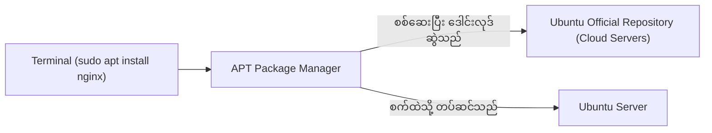
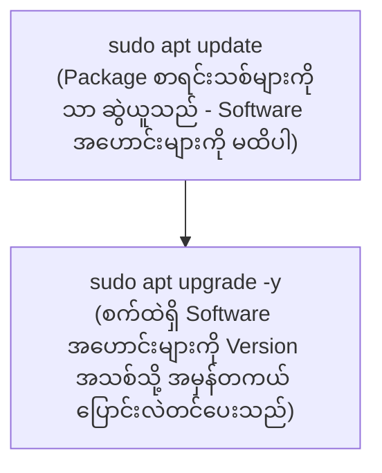

import { Aside } from "@astrojs/starlight/components";
import Quiz from "../../../../components/mdx/Quiz";
import LessonCompletion from "../../../../components/mdx/LessonCompletion";

<Aside title="💡 ရည်ရွယ်ချက်">
  Linux Server ပေါ်တွင် Node.js, Python, Git, Docker, Nginx ကဲ့သို့သော Software များကို စနစ်တကျ Install လုပ်ခြင်း၊ လုံခြုံရေး Patch များ Update ပြုလုပ်ခြင်းနှင့် Package Repository များကို စီမံခန့်ခွဲရာတွင် **`apt` (Advanced Package Tool)** ကို မဖြစ်မနေ သုံးစွဲရပါမည်။
</Aside>

## APT Package Manager ဆိုတာ ဘာလဲ?

Windows တွင် `.exe` သို့မဟုတ် macOS တွင် `.dmg` ဖိုင်များကို Download ဆွဲ၍ Install လုပ်ရသကဲ့သို့ မဟုတ်ဘဲ Linux တွင် **App Store** ကဲ့သို့ ဗဟို Repository များမှတစ်ဆင့် လုံခြုံစိတ်ချရသော Software များကို Command တစ်ကြောင်းတည်းဖြင့် တပ်ဆင်နိုင်ပါတယ်:



---

## `apt update` vs `apt upgrade` (အရေးကြီးသော ခြားနားချက်)

Developer အများစု အမြဲရောထွေးလေ့ရှိသော အဓိက Command နှစ်ခု ဖြစ်ပါတယ်:



### ၁။ `sudo apt update`
Ubuntu ၏ Repository Server များဆီမှ နောက်ဆုံးထွက် Software များ၏ **Version စာရင်း (Package Index Metadata)** ကိုသာ Download ဆွဲယူခြင်း ဖြစ်ပြီး၊ စက်ထဲရှိ မည်သည့် Software ကိုမှ Install သို့မဟုတ် Version မမြှင့်သေးပါ။

### ၂။ `sudo apt upgrade -y`
`apt update` ဖြင့် ရရှိလာသော စာရင်းသစ်အရ စက်ထဲတွင် လက်ရှိ Install လုပ်ထားသည့် Software အဟောင်းများကို နောက်ဆုံး Version သို့ အမှန်တကယ် **အဆင့်မြှင့်တင် (Upgrade)** ပေးခြင်း ဖြစ်ပါတယ်။

```bash
# Server အသစ် စတင်ဖွင့်တိုင်း ဤအစဉ်လိုက်အတိုင်း အမြဲ Run ရပါမည်:
sudo apt update && sudo apt upgrade -y
```

---

## အခြေခံ လိုအပ်သော Development Tools များ တပ်ဆင်ခြင်း

Server အသစ်တစ်လုံး စတင်အသုံးပြုပါက မရှိမဖြစ် လိုအပ်သော Tools များကို အောက်ပါအတိုင်း တစ်ပြိုင်နက် Install ပြုလုပ်နိုင်ပါတယ်:

```bash
sudo apt install -y curl wget git ufw htop build-essential unzip
```

### အဓိက Tools များ၏ အသုံးဝင်ပုံ:
- **`curl` & `wget`:** Internet မှ ဖိုင်များနှင့် APIs များကို Command Line ဖြင့် Download ဆွဲယူရန်။
- **`git`:** Source code များကို GitHub/GitLab မှ Clone ချရန်။
- **`htop`:** Server CPU, RAM နှင့် Running Processes များကို Graphic interface ဖြင့် ကြည့်ရန်။
- **`build-essential`:** `gcc`, `make` အစရှိသော C/C++ compilation tools များ (Node.js native modules များ build ရန် လိုအပ်ပါသည်)။

---

## Package ဖယ်ရှားခြင်းနှင့် Disk Cleanup ပြုလုပ်ခြင်း

Server တွင် မလိုအပ်တော့သော Software များနှင့် Cache ဖိုင်များကြောင့် Disk Space မပြည့်စေရန်:

```bash
# 1. Package တစ်ခုကို ဖယ်ရှားမည် (Config ဖိုင်များ ချန်ထားမည်)
sudo apt remove apache2

# 2. Package ရော ၎င်း၏ Config ဖိုင်များပါ အပြီးသတ် ဖျက်ထုတ်မည်
sudo apt purge apache2

# 3. မလိုအပ်တော့သော Dependency ဖိုင်ဟောင်းများကို အလိုအလျောက် သန့်ရှင်းမည်
sudo apt autoremove -y

# 4. ဒေါင်းလုဒ်ဆွဲထားသော .deb installation cache များကို ရှင်းထုတ်မည်
sudo apt clean
```

---

## External Repositories (PPAs & Third-party Sources) ထည့်သွင်းခြင်း

Ubuntu ၏ မူလ Repository တွင် ပါဝင်သော Software များသည် တည်ငြိမ်မှု (Stability) ကို ဦးစားပေးသဖြင့် Node.js ကဲ့သို့ Version မြန်မြန်တက်သော နည်းပညာများသည် Version အနည်းငယ် နောက်ကျနေတတ်ပါတယ်။

ထို့ကြောင့် **Official NodeSource Repository** ကဲ့သို့ တရားဝင် External Source များကို ထည့်သွင်းရန် လိုအပ်ပါတယ်:

### Node.js (LTS Version) တပ်ဆင်နည်း ဥပမာ:

```bash
# 1. NodeSource Official Setup Script ကို ဒေါင်းလုဒ်ဆွဲ၍ Run မည် (ဥပမာ Node.js 22 LTS)
curl -fsSL https://deb.nodesource.com/setup_22.x | sudo -E bash -

# 2. Node.js နှင့် NPM ကို Install ပြုလုပ်မည်
sudo apt install -y nodejs

# 3. Version မှန်ကန်စွာ တပ်ဆင်ပြီးစီးခြင်း ရှိမရှိ စစ်ဆေးမည်
node -v
npm -v
```

---

## 🎯 သင်ခန်းစာ အနှစ်ချုပ် Checklist

- [ ] `sudo apt update` ဖြင့် Package list သစ်များကို အမြဲ အရင် ဆွဲယူပါ။
- [ ] ပုံမှန် လုံခြုံရေး Patch များ ရရှိစေရန် `sudo apt upgrade -y` ပြုလုပ်ပါ။
- [ ] Server တွင် Disk Space ရှင်းလင်းရန် `sudo apt autoremove -y` ကို အခါအားလျော်စွာ သုံးပါ။
- [ ] နောက်ဆုံးထွက် Runtime (Node.js/Docker) များအတွက် Official External Repository ထည့်သွင်းနည်းကို သုံးပါ။

## 🧠 အသိပညာ စစ်ဆေးမှု (Quiz)

<Quiz
  client:idle
  title="APT Package Management စစ်ဆေးမှု"
  questions={[
    {
      id: "q1",
      question: "'sudo apt update' နှင့် 'sudo apt upgrade' တို့၏ အဓိက ခြားနားချက်မှာ အဘယ်နည်း?",
      options: [
        "update သည် package များ၏ version metadata စာရင်းသစ်ကိုသာ ဆွဲယူပြီး၊ upgrade သည် လက်ရှိ software များကို version သစ်သို့ အမှန်တကယ် ပြောင်းလဲတင်ပေးခြင်း ဖြစ်သည်",
        "update သည် OS တစ်ခုလုံးကို ပြန် install လုပ်ပြီး၊ upgrade သည် RAM ကို ရှင်းလင်းပေးသည်",
        "နှစ်ခုလုံးသည် အတူတူပင် ဖြစ်ပြီး မည်သည့်အရာကို သုံးသုံး ရနိုင်သည်",
        "upgrade ကို အရင် run ပြီးမှ update ကို run ရသည်"
      ],
      correctAnswer: 0,
      explanation: "update သည် repository server များဆီမှ package catalog အသစ်ကိုသာ download ဆွဲယူခြင်းဖြစ်ပြီး၊ software များကို အမှန်တကယ် install/upgrade မလုပ်သေးပါ။ upgrade ကသာ အသစ်တင်ပေးခြင်း ဖြစ်ပါသည်။"
    },
    {
      id: "q2",
      question: "Server တွင် မလိုအပ်တော့သော library ဖိုင်ဟောင်းများနှင့် dependencies များကို ရှင်းထုတ်ရန် မည်သည့် command ကို သုံးရမည်နည်း?",
      options: [
        "sudo apt clean-all",
        "sudo apt autoremove -y",
        "sudo apt delete",
        "sudo rm -rf /etc/apt"
      ],
      correctAnswer: 1,
      explanation: "apt autoremove သည် အခြား package များနှင့် ဆက်နွယ်မှု မရှိတော့သည့် orphaned packages များကို အလိုအလျောက် သန့်ရှင်းဖယ်ရှားပေးပါသည်။"
    }
  ]}
/>

<LessonCompletion
  client:idle
  lessonId="linux-devops-03-packages"
  lessonTitle="Ubuntu Package Management"
/>
