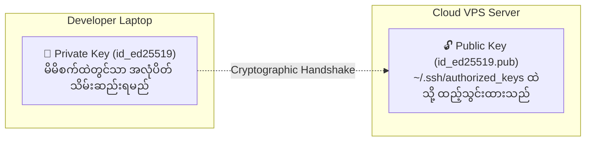

import { Aside } from "@astrojs/starlight/components";
import LessonCompletion from "../../../../components/mdx/LessonCompletion";

<Aside title="💡 ရည်ရွယ်ချက်">
  Cloud VPS (DigitalOcean, AWS, Hetzner, Linode) အသစ်တစ်ခု စတင်ဖွင့်လှစ်သည့်အခါ Password ဖြင့်သာ Login ဝင်ပါက Hacker Bot များ၏ Brute-force တိုက်ခိုက်မှုဒဏ်ကို ချက်ချင်း ခံရနိုင်ပါတယ်။ ဤသင်ခန်းစာတွင် **ခေတ်မီ Ed25519 SSH Key Pair** ဖြင့် ၁၀၀% လုံခြုံသော Password-less Authentication စနစ် တည်ဆောက်ပါမည်။
</Aside>

## SSH Key Cryptography အလုပ်လုပ်ပုံ (Public vs Private Key)

SSH Keys စနစ်သည် **Asymmetric Cryptography (မညီမျှသော သော့တွဲစနစ်)** ပေါ်တွင် အခြေခံထားပါတယ်:



1. **Private Key (`id_ed25519`):** ခင်ဗျား၏ Laptop ထဲတွင်သာ အမြဲရှိနေရမည်ဖြစ်ပြီး မည်သူ့ကိုမျှ (GitHub အပါအဝင်) လုံးဝ မပြသရသော လျှို့ဝှက်သော့ ဖြစ်သည်။
2. **Public Key (`id_ed25519.pub`):** Server ပေါ်သို့ ပို့ဆောင်သိမ်းဆည်းထားသော အများပြည်သူသုံး သော့ခလောက် ဖြစ်သည်။

---

## အဆင့် ၁: Local Computer တွင် SSH Key Pair ထုတ်ယူခြင်း

မိမိ၏ Mac သို့မဟုတ် Windows Terminal တွင် အောက်ပါ Command ကို Run ပါ (RSA ထက် ပိုမိုမြန်ဆန်ပြီး လုံခြုံသော **Ed25519** ကို အသုံးပြုပါသည်):

```bash
ssh-keygen -t ed25519 -C "admin@takkatho.dev"
```

1. ဖိုင်သိမ်းမည့် နေရာ မေးပါက `Enter` သာ နှိပ်ပါ။ (Default: `~/.ssh/id_ed25519`)
2. Passphrase (စကားဝှက်) မေးပါက အပိုလုံခြုံရေးအတွက် စကားဝှက် ရိုက်ထည့်နိုင်ပါသည် သို့မဟုတ် `Enter` နှိပ်၍ ကျော်နိုင်ပါသည်။

---

## အဆင့် ၂: Public Key အား Server ပေါ်သို့ ကူးယူတင်သွင်းခြင်း

### နည်းလမ်း A: `ssh-copy-id` ဖြင့် အလွယ်တကူ တင်ခြင်း (Recommended)
```bash
ssh-copy-id ubuntu@YOUR_VPS_IP
```

### နည်းလမ်း B: Manual ကူးယူနည်း
အကယ်၍ `ssh-copy-id` မရပါက မိမိစက်မှ Public Key ကို ကူးယူပါ:
```bash
cat ~/.ssh/id_ed25519.pub
```
ထွက်လာသော `ssh-ed25519 AAAA...` စာကြောင်းရှည်ကို Copy ကူးပြီး Server ထဲရှိ `~/.ssh/authorized_keys` ထဲသို့ သွားရောက် Paste လုပ်ပေးရပါမည်:
```bash
# Server ပေါ်တွင်:
mkdir -p ~/.ssh
chmod 700 ~/.ssh
nano ~/.ssh/authorized_keys
# (Paste the public key here)
chmod 600 ~/.ssh/authorized_keys
```

---

## အဆင့် ၃: SSH Server Configuration ကို Hardening ပြုလုပ်ခြင်း

ယခုအခါ Password မလိုဘဲ SSH Key ဖြင့်သာ Login ဝင်ခွင့်ပြုရန် Server ၏ SSH Config ကို ပြင်ဆင်ပါမည်:

```bash
sudo nano /etc/ssh/sshd_config
```

အောက်ပါ Setting ၃ ခုကို ရှာဖွေ၍ ပြင်ဆင်ပါ:

```ini
# 1. Root အကောင့်ဖြင့် တိုက်ရိုက် SSH ဝင်ခွင့်ကို ပိတ်မည်
PermitRootLogin no

# 2. စကားဝှက် (Password) ဖြင့် Login ဝင်ခွင့်ကို လုံးဝ ပိတ်မည် (Brute-force ကာကွယ်ရန်)
PasswordAuthentication no

# 3. Public Key ဖြင့်သာ Login ဝင်ခွင့်ကို ဖွင့်မည်
PubkeyAuthentication yes
```

<Aside type="tip" title="💡 Default Port 22 ကို ပြောင်းလဲခြင်း">
  Bot များသည် Port 22 သို့ အလိုအလျောက် တိုက်ခိုက်မှုများ ပြုလုပ်လေ့ရှိသဖြင့် Port နံပါတ်ကို `Port 2222` ကဲ့သို့ စိတ်ကြိုက် ပြောင်းလဲထားနိုင်ပါသည်။
</Aside>

---

## အဆင့် ၄: SSH Service ကို Restart မလုပ်မီ စစ်ဆေးခြင်း

<Aside type="danger" title="🚨 အရေးကြီး သတိပေးချက်">
  Config ပြင်ပြီးသည်နှင့် လက်ရှိ ဖွင့်ထားသော Terminal Window ကို **လုံးဝ မပိတ်ပါနှင့်**! အခြား Terminal Tab အသစ်တစ်ခု ဖွင့်ပြီး Login အောင်မြင်စွာ ဝင်ရမရ အရင်ဆုံး စမ်းသပ်ပါ။
</Aside>

```bash
# SSH Daemon ကို Restart လုပ်မည်
sudo systemctl restart ssh

# (သို့မဟုတ် Ubuntu အချို့တွင်)
sudo systemctl restart sshd
```

### Local Computer ရှိ Terminal Tab အသစ်မှ စမ်းသပ် Login ဝင်ခြင်း:
```bash
ssh -i ~/.ssh/id_ed25519 ubuntu@YOUR_VPS_IP
```
Password တောင်းဆိုခြင်း မရှိဘဲ ချက်ချင်း Server ထဲသို့ ရောက်ရှိသွားပါက ခင်ဗျား၏ VPS သည် အောင်မြင်စွာ လုံခြုံသွားပြီ ဖြစ်ပါသည်။

---

## 🎯 သင်ခန်းစာ အနှစ်ချုပ်

- [ ] အမြဲတမ်း `ed25519` SSH Key algorithm ကို သုံးပါ။
- [ ] Server ပေါ်တွင် `PasswordAuthentication no` သတ်မှတ်ပါ။
- [ ] Root User ဖြင့် တိုက်ရိုက် Login မဝင်ဘဲ `sudo` User ဖြင့်သာ ဝင်ရောက်ပါ။

<LessonCompletion
  client:idle
  lessonId="linux-devops-05-ssh-hardening"
  lessonTitle="SSH Keys and Server Hardening"
/>
