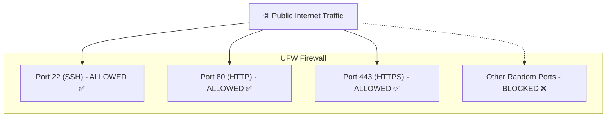
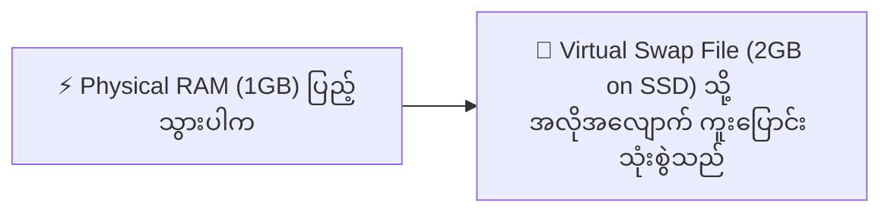

import { Aside } from "@astrojs/starlight/components";
import Quiz from "../../../../components/mdx/Quiz";
import LessonCompletion from "../../../../components/mdx/LessonCompletion";

<Aside title="💡 ရည်ရွယ်ချက်">
  Server ပေါ်တွင် မလိုအပ်သော Ports များ ပွင့်နေပါက Hacker များ ဝင်ရောက်တိုက်ခိုက်နိုင်ပါတယ်။ ဤသင်ခန်းစာတွင် **UFW Firewall** ဖြင့် Traffic ထိန်းချုပ်ခြင်း၊ **Fail2ban** ဖြင့် တိုက်ခိုက်သူ IP များကို အလိုအလျောက် ပိတ်ဆို့ခြင်းနှင့် RAM နည်းသော VPS များ Out of Memory မဖြစ်စေရန် **Swap Memory** ထည့်သွင်းခြင်းတို့ကို လေ့လာပါမည်။
</Aside>

## UFW (Uncomplicated Firewall) ဆိုတာ ဘာလဲ?

UFW သည် Linux Kernel ၏ ရှုပ်ထွေးသော `iptables` စည်းမျဉ်းများကို ရိုးရှင်းသော Commands များဖြင့် လွယ်ကူစွာ စီမံနိုင်စေရန် ပြုလုပ်ထားသော Host-level Firewall ဖြစ်ပါတယ်။



---

## UFW Firewall စနစ်တကျ Setup လုပ်နည်း

<Aside type="danger" title="🚨 အထူး သတိပြုရန်">
  Firewall ကို Enable မလုပ်မီ **SSH Port (22)** ကို အရင်ဆုံး Allow လုပ်ထားရပါမည်။ မဟုတ်ပါက လက်ရှိ Server ထဲမှ အပြီးသတ် ကန်ထုတ်ခံရပါမည်။
</Aside>

### အဆင့် ၁: Default Policy သတ်မှတ်ခြင်း
အဝင် Traffic အားလုံးကို မူလအားဖြင့် ပိတ်ထားပြီး အထွက် Traffic ကို ခွင့်ပြုပါမည်:
```bash
sudo ufw default deny incoming
sudo ufw default allow outgoing
```

### အဆင့် ၂: လိုအပ်သော Ports များကို ဖွင့်ပေးခြင်း
```bash
# 1. SSH ဆက်သွယ်မှုကို အရင်ဆုံး ဖွင့်ပါ
sudo ufw allow OpenSSH
# (သို့မဟုတ် Custom Port သုံးထားပါက: sudo ufw allow 2222/tcp)

# 2. Web Traffic များအတွက် HTTP (80) နှင့် HTTPS (443) ကို ဖွင့်ပါ
sudo ufw allow 80/tcp
sudo ufw allow 443/tcp
```

### အဆင့် ၃: Firewall ကို စတင် အသက်သွင်းခြင်း
```bash
sudo ufw enable
```

### အဆင့် ၄: Firewall အခြေအနေ စစ်ဆေးခြင်း
```bash
sudo ufw status verbose
```
Output တွင် Action ကော်လံ၌ `ALLOW IN` ဖြစ်နေသော Ports များကို ရှင်းလင်းစွာ တွေ့မြင်ရပါမည်။

---

## Fail2ban ဖြင့် Brute-force တိုက်ခိုက်မှုများကို ကာကွယ်ခြင်း

Bots များသည် Server သို့ တစ်စက္ကန့်လျှင် အကြိမ်ပေါင်းများစွာ Password မှန်းဆပြီး ဝင်ရောက်ရန် ကြိုးစားတတ်ကြပါတယ်။ **Fail2ban** သည် Authentication Log ဖိုင်များကို စောင့်ကြည့်ပြီး သတ်မှတ်အကြိမ်ထက် ပိုမှားယွင်းပါက ထို IP ကို Firewall မှတစ်ဆင့် ရက်သတ္တပတ်ပေါင်းများစွာ အလိုအလျောက် Ban ပစ်ပါတယ်:

```bash
# 1. Fail2ban Install ပြုလုပ်မည်
sudo apt install -y fail2ban

# 2. Custom Configuration File ကူးယူမည်
sudo cp /etc/fail2ban/jail.conf /etc/fail2ban/jail.local

# 3. Service စတင်ပြီး Enable လုပ်မည်
sudo systemctl enable --now fail2ban

# 4. လက်ရှိ Ban ထားသော Hacker IP စာရင်းကို ကြည့်မည်
sudo fail2ban-client status sshd
```

---

## RAM နည်းသော VPS များအတွက် Swap Memory Setup ပြုလုပ်ခြင်း

အကယ်၍ ခင်ဗျား၏ VPS Server သည် 1GB သို့မဟုတ် 2GB RAM သာရှိပါက Node.js Build လုပ်ချိန် သို့မဟုတ် Database Data များလာချိန်တွင် **"Out of Memory (OOM Kill)"** ဖြစ်ကာ Server Crash ကျတတ်ပါတယ်။

**Swap Memory** သည် Hard Disk ပေါ်တွင် Virtual RAM ၂ Gigabytes ခန့် နေရာချန်ထားပေးခြင်းဖြင့် Server Crash မဖြစ်အောင် ကယ်တင်ပေးနိုင်ပါတယ်:



### 2GB Swap Memory ဖန်တီးနည်း:

```bash
# 1. 2GB ရှိသော Swap ဖိုင်တစ်ခု အလွတ်ဆောက်မည်
sudo fallocate -l 2G /swapfile

# 2. ဖိုင်ကို root သာ ဖတ်နိုင်ရန် Permission ပိတ်မည်
sudo chmod 600 /swapfile

# 3. Swap ဖိုင်အဖြစ် Format ချမည်
sudo mkswap /swapfile

# 4. Swap ကို ချက်ချင်း စတင် သုံးစွဲမည်
sudo swapon /swapfile

# 5. Server Reboot ကျတိုင်း အလိုအလျောက် သုံးစေရန် /etc/fstab ထဲ ထည့်မည်
echo '/swapfile none swap sw 0 0' | sudo tee -a /etc/fstab
```

စစ်ဆေးရန်:
```bash
free -h
# Swap ကော်လံတွင် 2.0Gi ပေါ်လာသည်ကို တွေ့ရပါမည်!
```

---

## 🧠 အသိပညာ စစ်ဆေးမှု (Quiz)

<Quiz
  client:idle
  title="Firewall & Server Hardening စစ်ဆေးမှု"
  questions={[
    {
      id: "q1",
      question: "'sudo ufw enable' မနှိပ်မီ အဘယ်ကြောင့် SSH Port ကို ကြိုတင် allow လုပ်ထားရသနည်း?",
      options: [
        "Server Internet လိုင်း ပိုမြန်စေရန်",
        "ကြိုတင် မဖွင့်ထားပါက Firewall က SSH ကိုပါ ပိတ်ချလိုက်သဖြင့် Server ထဲသို့ ပြန်ဝင်မရတော့သောကြောင့်",
        "SSL Certificate Auto-renew ဖြစ်စေရန်",
        "Node.js Port ပြောင်းသွားနိုင်သောကြောင့်"
      ],
      correctAnswer: 1,
      explanation: "UFW ၏ default policy သည် incoming traffic အားလုံးကို deny လုပ်ထားသဖြင့် SSH ကို ကြိုတင် allow မလုပ်ပါက ခင်ဗျား၏ လက်ရှိ session ပါ ပြတ်တောက်သွားပါမည်။"
    }
  ]}
/>

<LessonCompletion
  client:idle
  lessonId="linux-devops-06-firewall-swap"
  lessonTitle="Firewall, Fail2ban and Swap Memory"
/>
