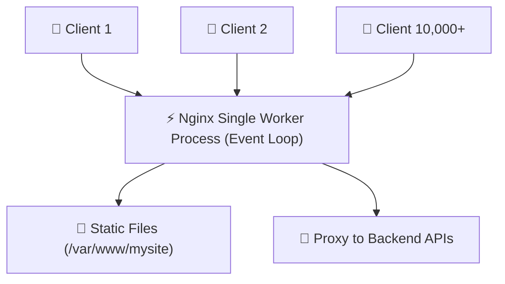

import { Aside } from "@astrojs/starlight/components";
import LessonCompletion from "../../../../components/mdx/LessonCompletion";

<Aside title="💡 ရည်ရွယ်ချက်">
  **Nginx (Engine-X)** သည် ကမ္ဘာ့အသုံးအများဆုံး High-performance Web Server နှင့် Reverse Proxy ဖြစ်ပါတယ်။ ဤသင်ခန်းစာတွင် Nginx ၏ Architecture၊ Server Blocks ဖွဲ့စည်းပုံနှင့် HTML/React/Astro Static Builds များကို Server ပေါ်တွင် စနစ်တကျ Host လုပ်နည်းကို လေ့လာပါမည်။
</Aside>

## Nginx ဆိုတာ ဘာလဲ? (Event-driven Architecture)

ရိုးရာ Apache Web Server သည် ဝင်လာသော User Request တစ်ခုချင်းစီအတွက် Process/Thread အသစ်တစ်ခုစီ ဖွင့်ရသဖြင့် Memory အလွန်ကုန်ကျပါတယ်။

**Nginx** သည် **Asynchronous, Non-blocking Event-driven Architecture** ကို အသုံးပြုထားသောကြောင့် Server RAM နည်းနည်းဖြင့် User Request သိန်းပေါင်းများစွာကို တစ်ပြိုင်နက်တည်း အလွန် လျင်မြန်စွာ လက်ခံဖြေကြားပေးနိုင်ပါတယ်:



---

## Nginx တပ်ဆင်ခြင်းနှင့် စစ်ဆေးခြင်း

```bash
# 1. Nginx Install ပြုလုပ်မည်
sudo apt update
sudo apt install -y nginx

# 2. Nginx Service စတင်ပြီး အခြေအနေ စစ်ဆေးမည်
sudo systemctl enable --now nginx
sudo systemctl status nginx
```

မိမိ Browser မှ `http://YOUR_VPS_IP` ဟု ရိုက်ထည့်ကြည့်ပါက **"Welcome to nginx!"** မူလ စာမျက်နှာကို တွေ့မြင်ရပါမည်။

---

## Nginx Configuration Directory ဖွဲ့စည်းပုံ

Nginx ၏ အဓိက ဖိုင်များသည် `/etc/nginx/` အောက်တွင် တည်ရှိပါတယ်:

```
/etc/nginx/
├── nginx.conf                 # Global Master Configuration
├── sites-available/           # မိမိ ရေးဆွဲထားသော Domain Config အားလုံး သိမ်းဆည်းရာနေရာ
└── sites-enabled/             # အမှန်တကယ် Live ဖြစ်နေသော Config Symlinks များ
```

### Sites-Available vs Sites-Enabled စနစ်:
- **`sites-available`** တွင် Config ဖိုင်အသစ်များ ရေးဆွဲထားနိုင်ပါသည်။
- **`sites-enabled`** ထဲသို့ **Symbolic Link (`ln -s`)** ဖြင့် ချိတ်ဆက်ပေးလိုက်မှသာ Nginx က အဆိုပါ Website ကို စတင် အလုပ်လုပ်ပေးပါသည်။

---

## Static Website (React / Astro Build) Host ပြုလုပ်နည်း

Astro သို့မဟုတ် React ဖြင့် `npm run build` လုပ်ထားသော `dist` Folder ကို Server ပေါ်တွင် Host ပြုလုပ်ပါမည်:

### အဆင့် ၁: Website Files များအတွက် Folder ဆောက်ခြင်း
```bash
sudo mkdir -p /var/www/mysite/html
sudo chown -R ubuntu:ubuntu /var/www/mysite/html
```
(မိမိစက်မှ Build ထွက်လာသော HTML/CSS/JS ဖိုင်များကို ဤ Folder ထဲသို့ ထည့်သွင်းပါ)

### အဆင့် ၂: Server Block (Virtual Host) ဖိုင် ရေးဆွဲခြင်း
```bash
sudo nano /etc/nginx/sites-available/mysite.conf
```

အောက်ပါ Configuration ကို ထည့်သွင်းပါ:

```nginx
server {
    listen 80;
    listen [::]:80;

    server_name example.com www.example.com;

    root /var/www/mysite/html;
    index index.html index.htm;

    # Single Page App (SPA) Routing & Static Files
    location / {
        try_files $uri $uri/ /index.html;
    }

    # Gzip Compression အမြန်နှုန်းမြှင့်တင်ခြင်း
    gzip on;
    gzip_types text/plain text/css application/json application/javascript text/xml;

    # Static Assets Caching
    location ~* \.(jpg|jpeg|png|gif|ico|css|js|svg|webp)$ {
        expires 30d;
        add_header Cache-Control "public, no-transform";
    }
}
```

---

## အဆင့် ၃: Site ကို Enable လုပ်ခြင်းနှင့် Syntax စစ်ဆေးခြင်း

```bash
# 1. sites-enabled သို့ Symbolic Link ချိတ်ဆက်မည်
sudo ln -s /etc/nginx/sites-available/mysite.conf /etc/nginx/sites-enabled/

# 2. မူလ Default Configuration ကို ဖြုတ်ပစ်မည်
sudo rm /etc/nginx/sites-enabled/default

# 3. Nginx Syntax အမှားပါမပါ အမြဲ စစ်ဆေးရပါမည် (CRITICAL STEP)
sudo nginx -t
```

Output တွင် `syntax is ok` နှင့် `test is successful` ဟု ပေါ်လာပါက:

```bash
# 4. Nginx ကို Reload လုပ်ပြီး Live တင်ပါ
sudo systemctl reload nginx
```

---

## 🎯 သင်ခန်းစာ အနှစ်ချုပ် Checklist

- [ ] Configuration ဖိုင်များကို `/etc/nginx/sites-available/` တွင် ရေးပြီး `sites-enabled/` သို့ Symlink ချိတ်ပါ။
- [ ] Nginx reload မလုပ်မီ `sudo nginx -t` ဖြင့် syntax အမှား အမြဲ စစ်ဆေးပါ။
- [ ] SPA Router များ (React/Next.js client) အတွက် `try_files $uri $uri/ /index.html;` ကို ထည့်သွင်းပါ။

<LessonCompletion
  client:idle
  lessonId="linux-devops-07-nginx-basics"
  lessonTitle="Nginx Fundamentals and Static Hosting"
/>
