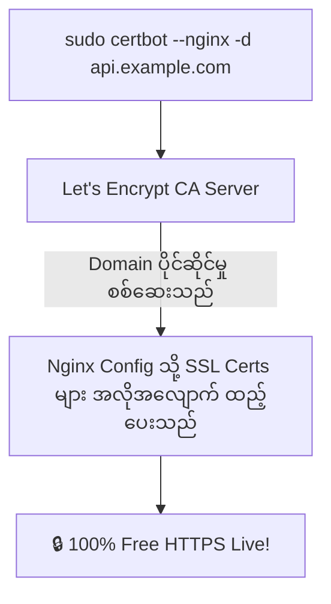

import { Aside } from "@astrojs/starlight/components";
import Quiz from "../../../../components/mdx/Quiz";
import LessonCompletion from "../../../../components/mdx/LessonCompletion";

<Aside title="💡 ရည်ရွယ်ချက်">
  Production Server ပေါ်တွင် Node.js, Python, Go သို့မဟုတ် Docker Containers များကို Port 3000, 8080 ကဲ့သို့သော Internal Port များဖြင့်သာ Run ထားလေ့ရှိပါတယ်။ အပြင်လောကမှ User များက Standard Domain (e.g. `api.example.com`) ဖြင့် **လုံခြုံသော HTTPS (Port 443)** မှတစ်ဆင့် ချိတ်ဆက်နိုင်ရန် **Nginx Reverse Proxy** နှင့် **Certbot SSL** ကို အသုံးပြုရပါမည်။
</Aside>

## Reverse Proxy Architecture အလုပ်လုပ်ပုံ

Forward Proxy (VPN ကဲ့သို့) သည် Client ဘက်မှ အပြင်သို့ ထွက်ရန် ကူညီပေးသော်လည်း **Reverse Proxy** သည် Server ဘက်မှ ရပ်တည်ပြီး ဝင်လာသော User Traffic များကို သက်ဆိုင်ရာ Internal Backend Applications များဆီသို့ ညွှန်ကြားပေးပါတယ်:

```mermaid
graph LR
    User["🌐 User (https://api.example.com)"] -->|Port 443 HTTPS (SSL)| Nginx["🛡️ Nginx Reverse Proxy"]
    Nginx -->|proxy_pass :3000| NodeApp["🟢 Node.js API (localhost:3000)"]
    Nginx -->|proxy_pass :8080| DockerApp["🐳 Docker Container (localhost:8080)"]
```

---

## Nginx Reverse Proxy Configuration ရေးဆွဲနည်း

`/etc/nginx/sites-available/api.conf` တွင် အောက်ပါအတိုင်း ရေးဆွဲပါမည်:

```nginx
server {
    listen 80;
    server_name api.example.com;

    location / {
        # Backend Application လည်ပတ်နေသော Internal Port သို့ လမ်းကြောင်းလွှဲမည်
        proxy_pass http://127.0.0.1:3000;

        # မူလ Client ၏ IP Address နှင့် Domain Name ကို Backend သို့ လက်ဆင့်ကမ်း ပို့ပေးခြင်း
        proxy_set_header Host $host;
        proxy_set_header X-Real-IP $remote_addr;
        proxy_set_header X-Forwarded-For $proxy_add_x_forwarded_for;
        proxy_set_header X-Forwarded-Proto $scheme;

        # WebSocket နှင့် Real-time Handshake ချိတ်ဆက်မှုများအတွက် Headers
        proxy_http_version 1.1;
        proxy_set_header Upgrade $http_upgrade;
        proxy_set_header Connection "upgrade";

        # Timeouts သတ်မှတ်ခြင်း
        proxy_connect_timeout 60s;
        proxy_send_timeout 60s;
        proxy_read_timeout 60s;
    }
}
```

```bash
# Symlink ချိတ်ပြီး Nginx ကို စစ်ဆေး reload လုပ်မည်
sudo ln -s /etc/nginx/sites-available/api.conf /etc/nginx/sites-enabled/
sudo nginx -t
sudo systemctl reload nginx
```

---

## Let's Encrypt Certbot ဖြင့် အခမဲ့ HTTPS SSL တပ်ဆင်ခြင်း

ယခုအခါ Domain ကို လုံခြုံသော **HTTPS (Padlock အစိမ်းရောင်)** ဖြစ်စေရန် **EFF (Electronic Frontier Foundation)** ၏ တရားဝင် **Certbot** ကို သုံးပါမည်:



### အဆင့် ၁: Certbot တပ်ဆင်ခြင်း
```bash
sudo apt install -y certbot python3-certbot-nginx
```

### အဆင့် ၂: SSL Certificate ထုတ်ယူပြီး Nginx တွင် အလိုအလျောက် တပ်ဆင်ခြင်း
```bash
sudo certbot --nginx -d api.example.com
```

- မိမိ၏ Email Address ရိုက်ထည့်ပေးပါ။
- Terms of Service ကို သဘောတူရန် `y` နှိပ်ပါ။
- HTTP မှ HTTPS သို့ အလိုအလျောက် Redirect လုပ်မလား မေးပါက **`Redirect`** ကို ရွေးချယ်ပါ။

Certbot သည် Nginx ဖိုင်ကို အလိုအလျောက် Edit လုပ်ပြီး SSL Keys များနှင့် Port 443 Configuration များကို ထည့်သွင်းပေးသွားပါမည်!

---

## SSL Auto-renewal စစ်ဆေးခြင်း

Let's Encrypt SSL Certificates များသည် **ရက်ပေါင်း ၉၀** သာ သက်တမ်းရှိသော်လည်း Certbot သည် Linux Cron / Systemd Timer ဖြင့် ရက်ပေါင်း ၆၀ ပြည့်တိုင်း **အလိုအလျောက် သက်တမ်းတိုး (Auto-renew)** ပေးပါတယ်:

```bash
# Auto-renewal စနစ် အမှန်တကယ် အလုပ်လုပ်မလုပ် စမ်းသပ်ခြင်း (Dry Run)
sudo certbot renew --dry-run
```
Output တွင် **"Congratulations, all simulated renewals succeeded"** ဟု တွေ့ရပါက ခင်ဗျား၏ Server ပေါ်ရှိ SSL များသည် တစ်သက်တာလုံး အခမဲ့ အလိုအလျောက် သက်တမ်းတိုးသွားပါမည်။

---

## 🧠 အသိပညာ စစ်ဆေးမှု (Quiz)

<Quiz
  client:idle
  title="Reverse Proxy & SSL စစ်ဆေးမှု"
  questions={[
    {
      id: "q1",
      question: "Nginx Reverse Proxy တွင် 'X-Real-IP' နှင့် 'X-Forwarded-For' Headers များကို ထည့်သွင်းပေးရခြင်း၏ ရည်ရွယ်ချက်မှာ အဘယ်နည်း?",
      options: [
        "Server Disk Space သက်သာစေရန်",
        "Backend Application (Node.js) သည် User ၏ အမှန်တကယ် Client IP Address ကို သိရှိစေရန်",
        "SSL Certificate သက်တမ်း တိုးမြှင့်ရန်",
        "Port 3000 ကို Firewall မှ ပိတ်ပင်ရန်"
      ],
      correctAnswer: 1,
      explanation: "Reverse Proxy ခံထားပါက Backend App သို့ ရောက်လာသော Request များ၏ IP သည် 127.0.0.1 ဖြစ်နေပါမည်။ User ၏ အစစ်အမှန် IP ကို သိရှိစေရန် အဆိုပါ Header များကို လက်ဆင့်ကမ်း ပို့ပေးရပါသည်။"
    }
  ]}
/>

<LessonCompletion
  client:idle
  lessonId="linux-devops-08-reverse-proxy-ssl"
  lessonTitle="Nginx Reverse Proxy and Let's Encrypt SSL"
/>
