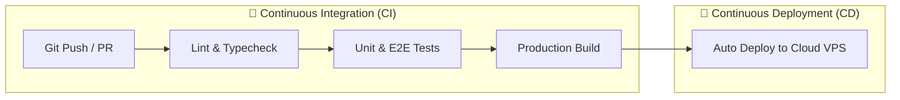

import { Aside } from "@astrojs/starlight/components";
import Quiz from "../../../../components/mdx/Quiz";
import LessonCompletion from "../../../../components/mdx/LessonCompletion";

<Aside title="💡 ရည်ရွယ်ချက်">
  Code အသစ်ရေးတိုင်း Manual build လုပ်ပြီး Server ပေါ်သို့ လက်ဖြင့် လိုက်တင်နေရခြင်းသည် အမှားအယွင်း ဖြစ်လွယ်ပြီး အချိန်ကုန်စေပါတယ်။ ဤသင်ခန်းစာတွင် **GitHub Actions** ဖြင့် `git push` လုပ်လိုက်သည်နှင့် အလိုအလျောက် Test စစ်ဆေးပေးပြီး Build ဆောက်ပေးသည့် **Automated CI Pipeline** ကို တည်ဆောက်ပါမည်။
</Aside>

## CI/CD ဆိုတာ ဘာလဲ?

**CI/CD** သည် ခေတ်မီ Software Engineering ၏ အခြေခံ အုတ်မြစ်ဖြစ်ပြီး အပိုင်းနှစ်ပိုင်း ပါဝင်ပါတယ်:



1. **Continuous Integration (CI):** Developer များ Code push လုပ်တိုင်း Unit Tests များ၊ Linter များနှင့် Build များကို Cloud Runner ပေါ်တွင် အလိုအလျောက် စစ်ဆေးပြီး Error ရှိက ချက်ချင်း Alert ပေးခြင်း။
2. **Continuous Deployment (CD):** စစ်ဆေးမှု အားလုံး အောင်မြင်ပါက Production Server ပေါ်သို့ လူမပါဘဲ အလိုအလျောက် တိုက်ရိုက် Deploy တင်ပေးခြင်း။

---

## GitHub Actions ၏ အဓိက အစိတ်အပိုင်း ၅ ခု

GitHub Actions သည် Repository ထဲရှိ `.github/workflows/*.yml` ဖိုင်များဖြင့် အလုပ်လုပ်ပါတယ်:

| အစိတ်အပိုင်း | အဓိပ္ပာယ် | ဥပမာ |
| :--- | :--- | :--- |
| **1. Event (`on:`)** | Workflow ကို စတင် အစပျိုးပေးသော လှုပ်ရှားမှု | `push: branches: [main]`, `pull_request` |
| **2. Job** | Runner တစ်ခုတည်းပေါ်တွင် အတူတကွ Run မည့် Steps အစုအဝေး | `jobs: test:`, `jobs: build:` |
| **3. Runner** | GitHub မှ ပေးထားသော Virtual Machine (VM) | `runs-on: ubuntu-latest` |
| **4. Step** | Job တစ်ခုအတွင်း အစဉ်လိုက် လုပ်ဆောင်မည့် Task တစ်ခုချင်းစီ | Run script သို့မဟုတ် Pre-built Action |
| **5. Action** | Community မှ ဖန်တီးထားသော ပြန်သုံးနိုင်သည့် Reusable Tool | `actions/checkout@v4`, `actions/setup-node@v4` |

---

## ပထမဆုံး CI Workflow ဖိုင် ရေးဆွဲခြင်း (`.github/workflows/ci.yml`)

မိမိ Project ၏ Root folder တွင် `.github/workflows/ci.yml` ဖိုင် ဆောက်ပြီး အောက်ပါအတိုင်း ရေးပါ:

```yaml
name: Continuous Integration (CI)

# main branch သို့ push လုပ်တိုင်း သို့မဟုတ် PR ဖွင့်တိုင်း Run မည်
on:
  push:
    branches: [main]
  pull_request:
    branches: [main]

jobs:
  test-and-build:
    name: Run Linter, Tests and Build
    runs-on: ubuntu-latest

    steps:
      # 1. Repository မှ Code များကို Runner ထဲသို့ ဆွဲယူမည်
      - name: Checkout Source Code
        uses: actions/checkout@v4

      # 2. Node.js Environment တပ်ဆင်မည် (with NPM Cache for Speed)
      - name: Setup Node.js 22
        uses: actions/setup-node@v4
        with:
          node-version: 22
          cache: "npm"

      # 3. Dependencies များ သွင်းမည်
      - name: Install Dependencies
        run: npm ci

      # 4. TypeScript Type Checking ပြုလုပ်မည်
      - name: Run Type Check
        run: npm run typecheck
        continue-on-error: false

      # 5. Automated Tests များ စစ်ဆေးမည်
      - name: Run Tests
        run: npm test

      # 6. Production Build အောင်မအောင် စစ်ဆေးမည်
      - name: Build Application
        run: npm run build
```

---

## GitHub Actions ၏ စွမ်းဆောင်ရည် မြှင့်တင်နည်းများ

1. **`npm ci` vs `npm install`:** CI Server များတွင် `npm install` မသုံးဘဲ `package-lock.json` အတိုင်း တိကျစွာ သွင်းပေးသည့် `npm ci` ကိုသာ သုံးရပါမည် (ပိုမိုမြန်ဆန်ပြီး Consistent ဖြစ်စေပါသည်)။
2. **Dependency Caching:** `actions/setup-node` ၏ `cache: 'npm'` option သည် `node_modules` cache ကို သိမ်းဆည်းထားသဖြင့် Build time ကို မိနစ်ပိုင်းမှ စက္ကန့်ပိုင်းအထိ လျှော့ချပေးပါတယ်။

---

## 🧠 အသိပညာ စစ်ဆေးမှု (Quiz)

<Quiz
  client:idle
  title="GitHub Actions CI စစ်ဆေးမှု"
  questions={[
    {
      id: "q1",
      question: "CI/CD Pipeline Runner ပေါ်တွင် 'npm install' အစား 'npm ci' ကို အဘယ်ကြောင့် အသုံးပြုသင့်သနည်း?",
      options: [
        "npm ci သည် package-lock.json ထဲရှိ version အတိုင်း တိကျစွာ install လုပ်ပေးပြီး အလွန် လျင်မြန်ကာ builds များကို consistent ဖြစ်စေသောကြောင့်",
        "npm ci သည် GitHub repository ကို အလိုအလျောက် deploy လုပ်ပေးသောကြောင့်",
        "npm ci သုံးပါက TypeScript compile လုပ်စရာ မလိုတော့သောကြောင့်",
        "npm install သည် Linux OS ပေါ်တွင် အလုပ်မလုပ်သောကြောင့်"
      ],
      correctAnswer: 0,
      explanation: "npm ci (Clean Install) သည် package-lock.json အတိုင်း တိကျစွာ match ဖြစ်အောင် install လုပ်ပေးပြီး package version ကွဲလွဲမှုကြောင့် ဖြစ်တတ်သော CI build errors များကို ကာကွယ်ပေးပါသည်။"
    },
    {
      id: "q2",
      question: "GitHub Actions workflow ဖိုင်များကို repository ၏ မည်သည့် folder လမ်းကြောင်းတွင် သိမ်းဆည်းရမည်နည်း?",
      options: [
        "/scripts/actions/",
        ".github/workflows/",
        "/src/ci/",
        "/workflows/"
      ],
      correctAnswer: 1,
      explanation: "GitHub Actions သည် repository root ရှိ .github/workflows/ folder အောက်ရှိ YAML ဖိုင်များ (*.yml သို့မဟုတ် *.yaml) ကိုသာ အလိုအလျောက် detect လုပ်ပြီး execute လုပ်ပေးပါသည်။"
    }
  ]}
/>

<LessonCompletion
  client:idle
  lessonId="linux-devops-09-github-actions"
  lessonTitle="GitHub Actions CI Fundamentals"
/>
