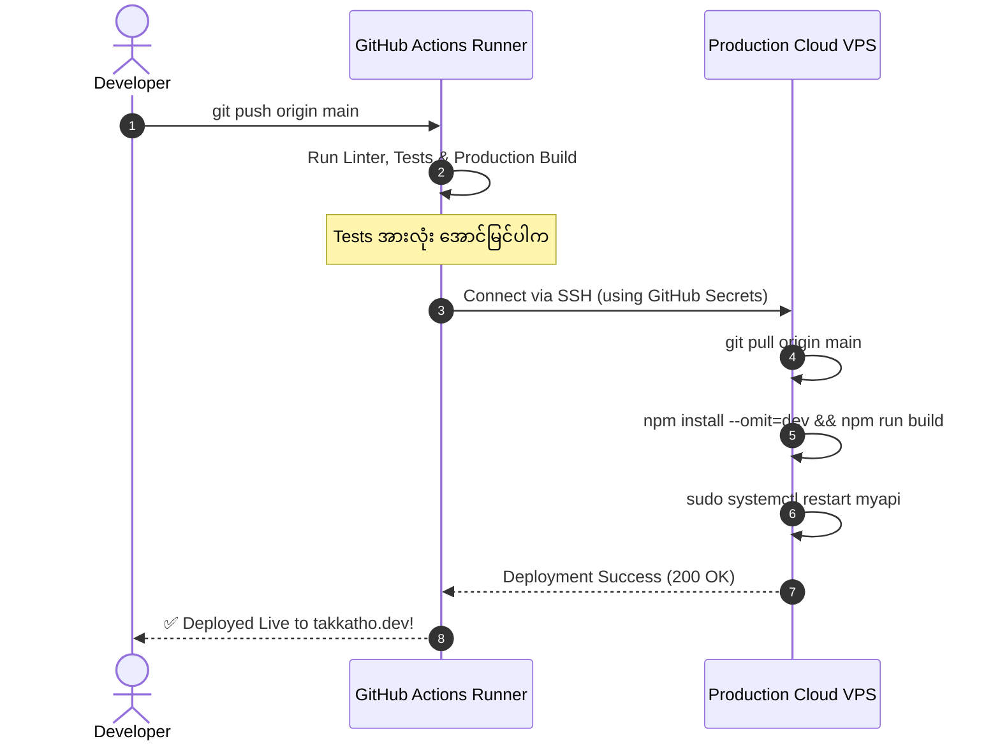

import { Aside } from "@astrojs/starlight/components";
import Quiz from "../../../../components/mdx/Quiz";
import LessonCompletion from "../../../../components/mdx/LessonCompletion";

<Aside title="💡 ရည်ရွယ်ချက်">
  CI Pipeline တွင် စစ်ဆေးမှုများ အောင်မြင်သွားပါက `main` branch သို့ Code အသစ်ရောက်သည်နှင့် Cloud VPS ပေါ်သို့ SSH ဖြင့် အလိုအလျောက် ဝင်ရောက်ပြီး **Node.js Service (သို့မဟုတ်) Docker Containers များကို Zero-downtime ဖြင့် Deploy ပြုလုပ်ပေးမည့် Automated CD Pipeline** ကို တည်ဆောက်ပါမည်။
</Aside>

## Automated Deployment Workflow အဆင့်ဆင့်



---

## အဆင့် ၁: GitHub Secrets ထဲသို့ VPS အချက်အလက်များ ထည့်သွင်းခြင်း

လုံခြုံရေးအရ Server IP နှင့် SSH Keys များကို YAML ဖိုင်ထဲတွင် တိုက်ရိုက် မရေးဘဲ **GitHub Repository Settings > Secrets and variables > Actions** ထဲတွင် လျှို့ဝှက် သိမ်းဆည်းရပါမည်:

| Secret Name | တန်ဖိုး (Value) |
| :--- | :--- |
| **`VPS_HOST`** | ခင်ဗျား၏ Server Public IP (ဥပမာ `159.65.130.45`) |
| **`VPS_USERNAME`** | Server ပေါ်ရှိ User အမည် (ဥပမာ `ubuntu`) |
| **`VPS_SSH_KEY`** | Server သို့ ဝင်ရောက်နိုင်သော SSH Private Key အပြည့်အစုံ |
| **`VPS_PORT`** | SSH Port (ဥပမာ `22` သို့မဟုတ် `2222`) |

---

## အဆင့် ၂: Automated Deployment Workflow ရေးဆွဲခြင်း (`.github/workflows/deploy.yml`)

`.github/workflows/deploy.yml` တွင် အောက်ပါအတိုင်း ရေးဆွဲပါမည်:

```yaml
name: Deploy to Production VPS

on:
  push:
    branches:
      - main

jobs:
  deploy:
    name: SSH Deploy to Ubuntu VPS
    runs-on: ubuntu-latest

    steps:
      - name: Checkout Code
        uses: actions/checkout@v4

      # SSH Action ဖြင့် VPS ပေါ်သို့ လှမ်းဝင်ပြီး Script များ Run မည်
      - name: Execute Remote Deployment via SSH
        uses: appleboy/ssh-action@v1.0.3
        with:
          host: ${{ secrets.VPS_HOST }}
          username: ${{ secrets.VPS_USERNAME }}
          key: ${{ secrets.VPS_SSH_KEY }}
          port: ${{ secrets.VPS_PORT || 22 }}
          script: |
            set -e
            echo "🚀 Deployment Started..."
            cd /home/ubuntu/projects/my-api

            # 1. နောက်ဆုံး Code အသစ်များကို ဆွဲယူမည်
            git pull origin main

            # 2. Production Dependencies သွင်းပြီး Build ဆောက်မည်
            npm ci --omit=dev
            npm run build

            # 3. Systemd Service ကို Restart ပြုလုပ်မည် (Zero-downtime)
            sudo systemctl restart myapi

            # 4. Service အခြေအနေ ကောင်းမကောင်း စစ်ဆေးမည်
            sudo systemctl is-active --quiet myapi && echo "✅ Service is Active & Running!"
```

---

## Zero-Downtime Deployment အတွက် အကြံပြုချက်များ

1. **PM2 Cluster Mode သို့မဟုတ် Docker Swarm/K8s:** Traffic အလွန်များသော System များတွင် Service တစ်ခုလုံး ရပ်တန့်မသွားစေရန် Multiple Instances များကို အလှည့်ကျ Restart ချသည့် **Rolling Restart** နည်းပညာကို သုံးနိုင်ပါသည်။
2. **Nginx Health Checks:** Nginx မှ Backend App အသစ် အမှန်တကယ် နိုးထလာမှသာ User Traffic များကို ဖွင့်ပေးခြင်းဖြင့် 502 Bad Gateway Error များကို ရှောင်ရှားနိုင်ပါသည်။
3. **Database Migrations:** DB Schema အပြောင်းအလဲ ရှိပါက Code အသစ် မတက်မီ Migration Script များကို အရင်ဆုံး Run ရပါမည်။

---

## 🏆 Course Wrap-up & Production Deployment Checklist

ဂုဏ်ယူပါသည်! ခင်ဗျားသည် Linux Server စီမံခန့်ခွဲခြင်းမှသည် Production Cloud DevOps အထိ မရှိမဖြစ် လိုအပ်သော အသိပညာများကို အောင်မြင်စွာ တတ်မြောက်သွားပြီ ဖြစ်ပါသည်။

### Final Production Checklist:
- [x] **Linux CLI & Permissions:** `chmod 644`, `755` ဖြင့် ဖိုင်လုံခြုံရေး စနစ်တကျ သတ်မှတ်ထားခြင်း။
- [x] **Process Management:** `systemd` Service ဖြင့် Background ၂၄ နာရီ Auto-restart Run ထားခြင်း။
- [x] **Server Security:** Password Authentication ပိတ်ပြီး Ed25519 SSH Key သာ သုံးထားခြင်း။
- [x] **Firewall Hardening:** UFW Firewall (80, 443, 22) ဖွင့်ထားပြီး Fail2ban တပ်ဆင်ထားခြင်း။
- [x] **Reverse Proxy & SSL:** Nginx Proxy နှင့် Let's Encrypt Certbot ဖြင့် HTTPS Auto-renewal သတ်မှတ်ထားခြင်း။
- [x] **CI/CD Automation:** GitHub Actions ဖြင့် `git push` လုပ်တိုင်း VPS ပေါ်သို့ အလိုအလျောက် Deploy တင်ပေးခြင်း။

---

## 🧠 အသိပညာ စစ်ဆေးမှု (Final Quiz)

<Quiz
  client:idle
  title="CI/CD & DevOps Capstone စစ်ဆေးမှု"
  questions={[
    {
      id: "q1",
      question: "GitHub Actions တွင် Production Server ၏ SSH Private Key ကို အဘယ်ကြောင့် GitHub Secrets ထဲတွင် သိမ်းဆည်းရသနည်း?",
      options: [
        "Repository Public ဖြစ်နေပါကလည်း အခြားသူများ မမြင်တွေ့နိုင်ဘဲ လုံခြုံစွာ Encrypt လုပ်ထားနိုင်သောကြောင့်",
        "Build time ပိုမို မြန်ဆန်စေရန်",
        "Nginx Reverse Proxy က အလိုအလျောက် ဖတ်ရှုနိုင်ရန်",
        "Ubuntu Package Manager က တောင်းဆိုသောကြောင့်"
      ],
      correctAnswer: 0,
      explanation: "GitHub Secrets သည် Sensitive API keys နှင့် SSH credentials များကို Logs များနှင့် Public Codebase ထဲတွင် မပေါ်စေဘဲ Runner ကသာ သုံးစွဲနိုင်ရန် လုံခြုံစွာ Encrypt ပြုလုပ်ပေးထားပါသည်။"
    }
  ]}
/>

<LessonCompletion
  client:idle
  lessonId="linux-devops-10-automated-deployment"
  lessonTitle="Automated VPS Deployment"
/>
