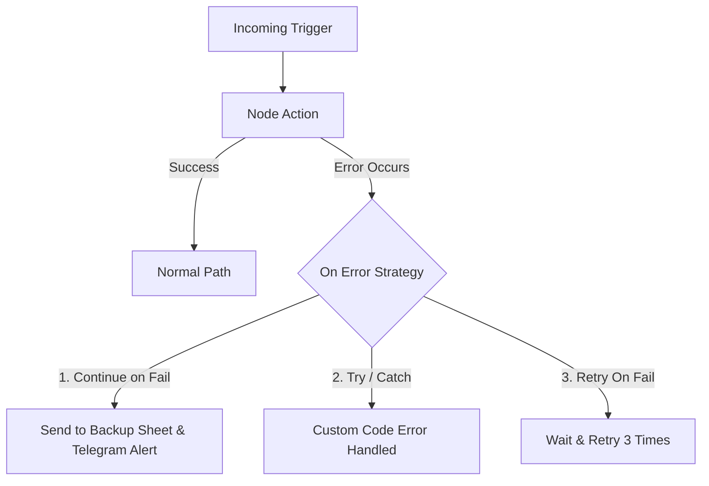

import { Aside } from "@astrojs/starlight/components";

<Aside title="💡 ရည်ရွယ်ချက်">
  Third-party API များ ခဏတာ Down သွားခြင်း သို့မဟုတ် Network Error ဖြစ်ပေါ်လာပါက Workflow မကျိုးဘဲ ဆက်လက် အလုပ်လုပ်နိုင်ရန် **Error Handling Strategy ၃ မျိုး** နှင့် **Global Error Trigger System** ကို တည်ဆောက်သွားရန် ဖြစ်ပါတယ်။
</Aside>

## ဘာကြောင့် Error Handling လိုအပ်သလဲ?

"Everything Fails, All the Time" (Amazon CTO Werner Vogels ၏ စကားအတိုင်း) Production စနစ်များတွင် Network Timeout, API 503 Overload သို့မဟုတ် Credential Throttling များ အမြဲ ဖြစ်ပေါ်နိုင်ပါတယ်။

Error Handling မပါဝင်ပါက Node တစ်ခု Crash ဖြစ်သည်နှင့် Workflow တစ်ခုလုံး ရပ်တန့်သွားပြီး အဓိက Data များ ပျောက်ဆုံးသွားနိုင်ပါတယ်။

---

## Error Handling Strategies ၃ မျိုး



### Strategy 1: Continue on Fail / Error Output Port (အကောင်းဆုံး နည်းလမ်း)
- Node ရဲ့ `Settings` -> `On Error` တွင် **Continue Using Error Output** ကို ရွေးပါ။
- Node ၏ ညာဘက်တွင် Output ၂ ခု (Success Path / Error Path) ခွဲထွက်လာမည် ဖြစ်ပါတယ်။
- Error Path အောက်တွင် **Backup Google Sheet Log** နှင့် **Telegram Team Alert Node** ကို ချိတ်ဆက်ပေးပါ။

### Strategy 2: Code Node ထဲတွင် try/catch သုံးခြင်း
- Custom JavaScript / Python ရေးသားရာတွင် unexpected errors များကို ဖြေရှင်းရန်:

```javascript
try {
  const phone = $input.item.json.phone;
  return { json: { cleanPhone: formatPhone(phone), status: "success" } };
} catch (error) {
  return { json: { cleanPhone: null, status: "failed", errorMessage: error.message } };
}
```

### Strategy 3: Retry On Fail (Automatic Retries)
- Network Flaky ဖြစ်မှုများ (429 Rate Limit သို့မဟုတ် Timeout) အတွက် Node Settings တွင်:
  - **Retry On Fail:** Enabled
  - **Max Tries:** 3 ကြိမ်
  - **Wait Between Tries:** 2000 ms (2 စက္ကန့်)

---

## Global Error Workflow (စနစ်တစ်ခုလုံးအတွက် Error Trigger)

Workflow တစ်ခုလုံး Fail ဖြစ်သွားပါက သီးသန့် အလိုအလျောက် သတိပေးမည့် **Global Error Workflow** ဖန်တီးနည်း:

1. Workflow အသစ်တစ်လုံး ဖန်တီး၍ **Error Trigger** Node ကို ထည့်ပါ။
2. **Telegram Node** ဖြင့် ချိတ်ဆက်၍ Text တွင် အောက်ပါအတိုင်း ညွှန်းဆိုပါ:
   ```text
   🚨 ALERT: Workflow Fail ဖြစ်သွားပါသည်!
   • Workflow Name: {{ $json.workflow.name }}
   • Node Name: {{ $json.execution.error.node.name }}
   • Error Message: {{ $json.execution.error.message }}
   ```
3. မိမိ တည်ဆောက်ထားသော ပုံမှန် Workflow များ၏ **Settings** -> **Error Workflow** နေရာတွင် ဤ Global Error Workflow ကို ချိတ်ဆက်ထားပေးပါ။
