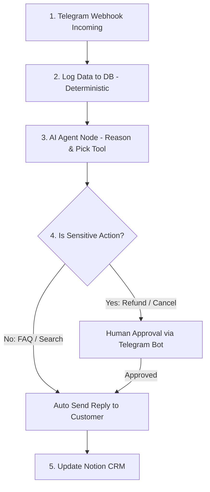

import { Aside } from "@astrojs/starlight/components";

<Aside title="💡 ရည်ရွယ်ချက်">
  Customer Support အတွက် **AI Agent** တစ်ခု တည်ဆောက်ပြီး၊ ထို Agent ကို Telegram Webhook၊ Human Approval Gate နှင့် CRM Updates ပါဝင်သော **Deterministic Hybrid Workflow** အတွင်းသို့ စနစ်တကျ ထည့်သွင်း တည်ဆောက်ရန် ဖြစ်ပါတယ်။
</Aside>

## Hybrid Architecture (EP0 Pattern)

---

## 1. AI Agent တွင် ပါဝင်သော Tools ၃ ခု

AI Agent ထံသို့ အောက်ပါ **Custom Tools (Sub-workflows)** များကို ချိတ်ဆက်ပေးရပါမည်:

1. **Order Lookup Tool (Sub-workflow):** Customer ၏ Order ID ဖြင့် Database / Sheets တွင် Status သွားရောက် စစ်ဆေးခြင်း။
2. **Product Search Tool (Sub-workflow):** ပစ္စည်း ရရှိနိုင်မှု (Stock) နှင့် ဈေးနှုန်းများကို ရှာဖွေပေးခြင်း။
3. **FAQ Tool (Vector Store / RAG):** ဆိုင်၏ ပို့ဆောင်ခနှင့် ပိတ်ရက် Policy များကို ပြန်လည် ဖြေကြားပေးခြင်း။

---

## 2. Agent ကို Hybrid Workflow တွင် တပ်ဆင်ခြင်း

1. **Telegram Trigger Node:** Customer မက်ဆေ့ချ်များ လက်ခံခြင်း။
2. **Deterministic Logging Node:** ဝင်ရောက်လာသော မက်ဆေ့ချ်တိုင်းကို Database သို့ ရေးသွင်းခြင်း (AI မရောက်မီ ကြိုတင် လော့ဂ်ယူခြင်း)။
3. **AI Agent Node:**
   - **Chat Model:** `claude-haiku-4-5-20251001` သို့မဟုတ် `gpt-4o-mini`
   - **Memory:** Simple Memory (`Session ID = {{ $json.message.chat.id }}`)
   - **Tools:** Order Lookup, Product Search, FAQ
4. **IF Node (Human Approval Gate):**
   - AI Agent ၏ တုံ့ပြန်မှုတွင် Refund (ငွေပြန်အမ်းခြင်း) သို့မဟုတ် Order Cancellation ပါဝင်ပါက **Telegram Admin Group** သို့ "Approve/Reject" ခလုတ်ဖြင့် စာပို့၍ လူကိုယ်တိုင် အတည်ပြုချက် တောင်းခံပါ။
5. **Auto Send & CRM Update:** Admin အတည်ပြုပါက သို့မဟုတ် ပုံမှန် မေးခွန်း ဖြစ်ပါက Customer ထံသို့ Auto-Reply ပို့ဆောင်ပြီး CRM (Notion / Google Sheets) တွင် Log အဆင့်မြှင့်ပါ။

---

## Performance & Cost Comparison

| နှိုင်းယှဉ်ချက် | Pure Agent-Everything System | Hybrid System (Recommended) |
|---|---|---|
| **တုံ့ပြန်မှု ကြာချိန် (Latency)** | ~၅ - ၈ စက္ကန့် (နှေးကွေး) | ~၁.၅ - ၂.၅ စက္ကန့် (အလွန် မြန်ဆန်) |
| **API Cost ကုန်ကျစရိတ်** | $0.05 / Message | $0.002 / Message (၂၅ ဆ သက်သာ) |
| **တည်ငြိမ်မှု (Reliability)** | Non-deterministic (အမှား ပါနိုင်) | ၉၉.၉% Deterministic & Safe |
