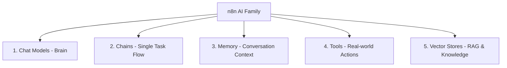

import { Aside } from "@astrojs/starlight/components";

<Aside title="💡 ရည်ရွယ်ချက်">
  n8n တွင် ပါဝင်သော AI Node Family များ၏ အမျိုးအစား ၅ ခု (Chat Models, Chains, Memory, Tools နှင့် Vector Stores) ကို နားလည်ပြီး၊ မည်သည့် နေရာတွင် မည်သည့် Node ကို သုံးစွဲရမည်ကို ခွဲခြား သိရှိစေရန် ဖြစ်ပါတယ်။
</Aside>

## n8n AI Node Categories ၅ ခု

---

## 1. Chat Models (AI ၏ ဦးနှောက်)

Chat Model Node များသည် LLM (Large Language Model) များထံသို့ တိုက်ရိုက် ချိတ်ဆက်ပေးသော Node များ ဖြစ်ပါသည်:

- **OpenAI Chat Model:** `gpt-4o`, `gpt-4o-mini` (High quality & tool calling)
- **Anthropic Chat Model:** `claude-haiku-4-5-20251001` (Fast & highly cost-effective)
- **Google Gemini Chat Model:** `gemini-2.5-flash` (Multi-modal support)
- **Ollama Chat Model:** Local တွင် Self-host ထားသော Open-source Models (Llama, Mistral) များအား zero API cost ဖြင့် သုံးစွဲခြင်း။

---

## 2. Chains vs. Agents

| အင်္ဂါရပ် | LLM Chains (Single Call / Chain) | AI Agents |
|---|---|---|
| **အလုပ်လုပ်ပုံ** | လမ်းကြောင်း တိကျစွာ သတ်မှတ်ထားသော Flow | AI အလိုအလျောက် Tool ကို ရွေးချယ် စဉ်းစားသော ReAct Loop |
| **ခန့်မှန်းရရှိနိုင်မှု** | Deterministic (ကြိုတင် မှန်းဆရ လွယ်ကူ) | Non-deterministic |
| **သင့်တော်သော အသုံးပြုမှု** | Summarization, Text Translation | Customer Support, Dynamic Multi-step Reasoning |

---

## 3. Memory (Conversation Context)

AI Models များသည် Default အားဖြင့် မက်ဆေ့ချ် တစ်ခုနှင့် တစ်ခုအကြား Memory မရှိကြပါ။

- **Simple Memory (Window Buffer Memory):**
  - **Context Window Length:** အရင် ပြောကြားခဲ့သော မက်ဆေ့ချ် Pairs ဘယ်နှစ်ခုကို မှတ်ထားမည်လဲ (ဥပမာ - `10`)။
  - **Session ID:** Customer ၏ Telegram Chat ID သို့မဟုတ် User ID ကို Session ID အဖြစ် သတ်မှတ်၍ တစ်ဦးချင်းစီ၏ စကားပြောဆိုမှုများကို သီးခြား ခွဲခြား သိုလှောင်ခြင်း။
