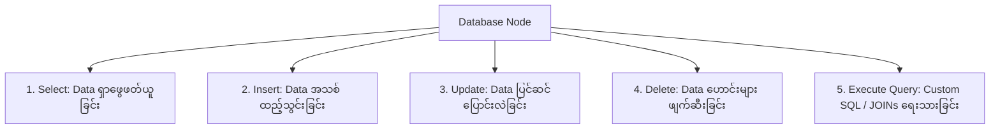

import { Aside } from "@astrojs/starlight/components";

<Aside title="💡 ရည်ရွယ်ချက်">
  Google Sheets ၏ Data အရေအတွက် ကန့်သတ်ချက်များကို ကျော်လွန်၍ n8n တွင် **MySQL, PostgreSQL သို့မဟုတ် Supabase** Database များကို အသုံးပြုကာ CRUD Operations (Create, Read, Update, Delete) များနှင့် Atomic Transactions များကို လုံခြုံစွာ တည်ဆောက်သွားရန် ဖြစ်ပါတယ်။
</Aside>

## ဘာကြောင့် Google Sheets မှ Database သို့ ပြောင်းလဲရသလဲ?

Google Sheets တွင် Data Row ၅,၀၀၀ မှ ၁၀,၀၀၀ အထက် ရောက်ရှိလာပါက:
- Loading ချိန် ကြာမြင့်လာခြင်း (Latency မြင့်မားခြင်း)။
- Concurrent Writes (လူအများအပြား တစ်ချိန်တည်း ဝင်ရောက် ရေးသားပါက) Data ပျောက်ဆုံးခြင်း။
- Complex Queries (ဥပမာ - Customer တစ်ဦး၏ လစဉ် အဝယ်စာရင်း ပေါင်းစပ်တွက်ချက်ခြင်း) ပြုလုပ်ရန် ခက်ခဲခြင်း။

---

## 1. Database Engines ၃ မျိုး နှိုင်းယှဉ်ချက်

| Engine | သင့်တော်သော အသုံးပြုမှု | n8n တည်ဆောက်ပုံ |
|---|---|---|
| **MySQL** | WooCommerce / WordPress Base e-Commerce ဆိုင်များ | Dedicated MySQL Node |
| **PostgreSQL** | Large-scale Production, Complex JSON Query များ, Self-host n8n Backend | Dedicated Postgres Node |
| **Supabase** | Cloud-hosted Backend-as-a-Service (PostgreSQL based) | REST API / PostgREST Headers |

---

## 2. Least Privilege Security (CRUD-only Database User)

n8n Credential တွင် Root / Admin Database Account များကို **တိုက်ရိုက် မသုံးပါနှင့်**။

Principle of Least Privilege အတိုင်း သီးသန့် ကန့်သတ်ထားသော Database User ကိုသာ ဖန်တီး အသုံးပြုပါ:

```sql
-- MySQL / Postgres User Creation Example
CREATE USER 'n8n_shop_user'@'%' IDENTIFIED BY 'StrongRandomPassword123!';
GRANT SELECT, INSERT, UPDATE, DELETE ON shop_db.orders TO 'n8n_shop_user'@'%';
GRANT SELECT, INSERT, UPDATE, DELETE ON shop_db.customers TO 'n8n_shop_user'@'%';
FLUSH PRIVILEGES;
```

---

## 3. n8n တွင် အသုံးပြုနိုင်သော 5 Database Operation Modes



### Hand-on Examples:
1. **Telegram Webhook → Insert Order:** ဝင်လာသော မက်ဆေ့ချ်များကို `orders` Table သို့ `INSERT` ပြုလုပ်ခြင်း။
2. **JOIN Query:** `SELECT o.id, c.name, o.total FROM orders o JOIN customers c ON o.customer_id = c.id WHERE o.status = 'pending';`
3. **Payment Status Update:** KPay/WavePay Confirmation ရရှိပါက Status ကို `pending` မှ `paid` သို့ `UPDATE` ပြုလုပ်ခြင်း။
4. **Scheduled Cleanup:** ရက်ပေါင်း ၉၀ ကျော်လွန်ပြီးသော Temp Session များကို အလိုအလျောက် `DELETE` ပြုလုပ်ခြင်း။

---

## 4. Transactions & Rollback (Atomic Operations)

Order ထည့်သွင်းခြင်း နှင့် Stock နှုတ်ခြင်း ကဲ့သို့သော အလုပ် ၂ ခုတွင် တစ်ခုခု Error တက်ပါက Data လွဲမှားမှု မဖြစ်စေရန် **Atomic Operation (BEGIN ... COMMIT / ROLLBACK)** ဖြင့် ကိုင်တွယ်ရပါမည်:

```sql
START TRANSACTION;
INSERT INTO orders (customer_id, total) VALUES (101, 25000);
UPDATE products SET stock = stock - 1 WHERE id = 5;
COMMIT; -- Error ဖြစ်ပါက ROLLBACK;
```
