import { Aside } from "@astrojs/starlight/components";

<Aside title="💡 ရည်ရွယ်ချက်">
  EP0 မှ EP10 အထိ သင်ယူခဲ့သော သင်ခန်းစာများ (Triggers, Data Transformation, Telegram API, Sub-workflows, Error Handling, AI Agents, Database Transactions နှင့် Self-hosting) အားလုံးကို ပေါင်းစပ်၍ **Full E-commerce System ကြီး** အဖြစ် Architecture ရေးဆွဲ တည်ဆောက်ရန် ဖြစ်ပါတယ်။
</Aside>

## Integrated System Architecture Map

```mermaid
graph TD
    subgraph 1. Order Processing Funnel
        A1[Telegram Orders] --> M1[Merge & Format Node]
        A2[Website Form Webhook] --> M1
        A3[TikTok Shop Webhook] --> M1
        M1 --> V1{IF Valid Data?}
        V1 -->|No| E1[Error Backup Sheet & Telegram Alert]
        V1 -->|Yes| B1{IF Amount > 50k MMK?}
        B1 -->|VIP| T1[Tag VIP & DB Atomic Transaction]
        B1 -->|Standard| T1
    end

    subgraph 2. Daily Sales Report
        S2[Schedule Trigger: Mon-Sat 8 AM] --> Q2[Execute SQL Query: Yesterday KPIs]
        Q2 --> AI2[AI Summary Node - Gemini]
        AI2 --> R2[Send HTML Email & Telegram Report]
    end

    subgraph 3. Multi-channel AI Support
        T3[Telegram / TikTok Comments] --> SA3[Sentiment Analysis Node]
        SA3 -->|Negative Sentiment| H3[Telegram Admin Alert - Human Approval]
        SA3 -->|Positive / FAQ| AG3[AI Support Agent Node]
        AG3 --> CR3[Auto Send Reply & Update CRM Database]
        H3 -->|Approved| CR3
    end
```

---

## 1. Workflow 1: Multi-Channel Order Processing

- **Multi-channel Intake:** Telegram Bot, Website Form Webhook နှင့် TikTok Shop Partner Center API အသီးသီးမှ ဝင်ရောက်လာသော အော်ဒါများကို **Merge Node (Append Mode)** ဖြင့် စုစည်းပါ။
- **Format Standardizer:** EP6 တွင် ဖန်တီးခဲ့သော **Execute Sub-workflow (Core: Format MM Phone)** ကို ခေါ်ယူ၍ ဖုန်းနံပါတ်များကို `+959...` ပုံစံဖြင့် Standardize ပြုလုပ်ပါ။
- **Validation & Exception Handling:** IF Node ဖြင့် စစ်ဆေး၍ Data ချို့ယွင်းပါက Backup Sheet သို့ ပို့ဆောင်ပြီး၊ ပြည့်စုံပါက Amount > 50,000 MMK မဟုတ် စစ်ဆေး၍ VIP/Standard Tag တပ်ပါ။
- **Atomic Database Transaction:** EP9 အတိုင်း Database (PostgreSQL/MySQL) သို့ `START TRANSACTION; INSERT INTO orders ... UPDATE products SET stock = stock - 1; COMMIT;` ပြုလုပ်ပါ။

---

## 2. Workflow 2: Daily Sales Summary Report

- **Schedule Trigger:** `Cron: 0 8 * * 1-6` (တနင်္လာ မှ စနေ၊ မနက် ၈ နာရီ)
- **Database Query:** မနေ့က ရောင်းရသော Order အကြောင်းရေ၊ တန်ဖိုး စုစုပေါင်းနှင့် Top Selling Items များကို SQL ဖြင့် Query ဆွဲပါ။
- **AI Executive Summary:** Gemini Chat Model ဖြင့် Data ကို ပို့ပေးပြီး မနက်ခင်းအတွက် အချက် ၂ ချက် အနှစ်ချုပ် ခိုင်းစေပါ။
- **Multi-channel Dispatch:** တတ်ကြွစွာ ရရှိလာသော Report ကို Management Team ထံ HTML Email နှင့် Telegram Group သို့ အလိုအလျောက် ပို့ဆောင်ပေးပါ။

---

## 3. Workflow 3: Multi-Channel AI Support (Hybrid Pattern)

- **Input Ingestion:** Telegram Inquiry နှင့် TikTok Business API Comment Webhook များ အားလုံးကို လက်ခံပါ။
- **Sentiment Analysis:** AI ဖြင့် မက်ဆေ့ချ်၏ Sentiment ကို စစ်ဆေးပါ:
  - **Negative Sentiment (စိတ်ဆိုးမကျေနပ်မှု):** Telegram Admin Alert သို့ ချက်ချင်း လွှဲပြောင်း၍ **Human-in-the-Loop Approval** တောင်းခံပါ။
  - **Positive / Standard Inquiry:** EP8 ၏ **AI Support Agent** (Order Lookup, Stock Check, FAQ Tools ပါဝင်သော) ထံသို့ လွှဲပြောင်း၍ Auto-Reply ပို့စေပြီး CRM Database တွင် Log ရေးသွင်းပါ။

---

## 7-Day Implementation Timeline for Consulting Clients

| နေ့ရက် | လုပ်ငန်းစဉ် |
|---|---|
| **Day 1** | Requirement Gathering & VPS Server (Docker + Postgres + Nginx SSL) Setup |
| **Day 2** | Workflow 1: Multi-channel Order Intake & Database Schema Setup |
| **Day 3** | Workflow 1: Validation, Error Backup & Transaction Testing |
| **Day 4** | Workflow 2: Daily Sales Report Query & AI Summary Setup |
| **Day 5** | Workflow 3: AI Support Agent + Telegram/TikTok Comment Webhooks |
| **Day 6** | End-to-End Integration Testing & Global Error Alert Workflows |
| **Day 7** | Client Training, Handoff & Production Go-Live |
