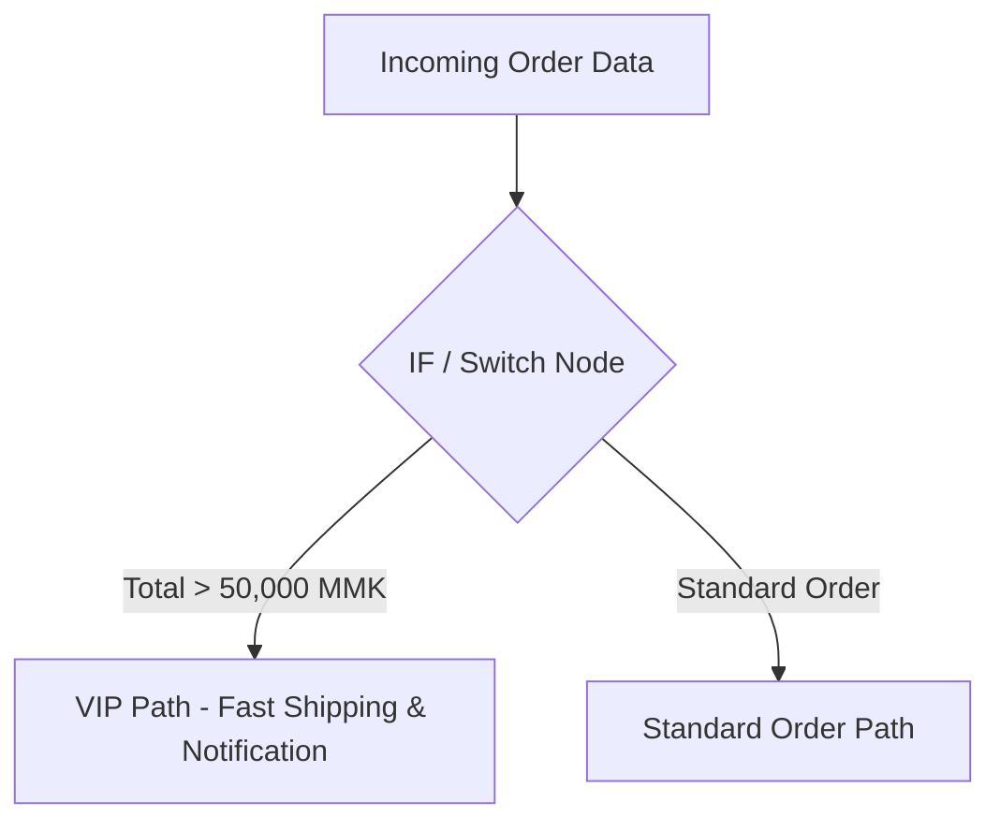

import { Aside } from "@astrojs/starlight/components";

<Aside title="💡 ရည်ရွယ်ချက်">
  မတူညီသော App များထံမှ စီးဆင်းလာသော Data များ (Data Format Mismatches) ကို စနစ်တကျ ရေဆေးသန့်စင်ခြင်း၊ Field Name များ Map ပြုလုပ်ခြင်းနှင့် လမ်းကြောင်း ခွဲခြားခြင်း (Branching) များကို နားလည်စေရန် ဖြစ်ပါတယ်။
</Aside>

## ဘာကြောင့် Data Transformation ကို ပြုလုပ်ရသလဲ?

Automation စနစ်များ ပျက်စီးရသည့် အဓိက အကြောင်းရင်းမှာ **App တစ်ခုနှင့် တစ်ခု Data လက်ခံသည့် Format မတူညီခြင်း** ကြောင့် ဖြစ်ပါတယ်။

ဥပမာ - Website Form ဘက်မှ `{ "user_name": "Mg Mg", "EMAIL": "MG@GMAIL.COM" }` ဟု ပေးပို့လိုက်သော်လည်း Google Sheets ဘက်မှ `username` နှင့် `email` စာလုံးအသေးဟု တောင်းဆိုနေပါက ကြားထဲတွင် **Data Transformation (Adapter)** ပြုလုပ်ပေးရန် လိုအပ်ပါတယ်။

---

## 1. Set (Edit Fields) Node

**Set Node** သည် Field များ အသစ် ဖန်တီးပေးခြင်း၊ Field Name များ Map ပြုလုပ်ပေးခြင်းနှင့် တန်ဖိုးများကို ပြောင်းလဲပေးခြင်းတို့တွင် အဓိက သုံးသော Node ဖြစ်ပါတယ်။

### အသုံးများသော Built-in Functions:

#### String Manipulation (စာသားများ):
- `{{ $json.name.toLowerCase() }}` : စာလုံးအသေး ပြောင်းခြင်း။
- `{{ $json.name.trim() }}` : မလိုလားအပ်သော ရှေ့နောက် Space များကို ဖယ်ရှားခြင်း။
- `{{ $json.text.slice(0, 100) }}` : စာလုံး ၁၀၀ ဖြတ်ယူခြင်း။

#### Number & Date (ဂဏန်းနှင့် ရက်စွဲ):
- `{{ Math.round($json.price) }}` : အနီးစပ်ဆုံး ကိန်းပြည့် ပြောင်းခြင်း။
- `{{ $now.plus({ days: 7 }).toFormat('dd MMM yyyy') }}` : ရက်စွဲ ပြင်ဆင်ခြင်း။

---

## 2. Logic & Branching Nodes



### IF Node (လမ်းကြောင်း ၂ ခု ခွဲခြင်း)
- Condition တစ်ခုကို စစ်ဆေး၍ `True` သို့မဟုတ် `False` လမ်းကြောင်း ၂ ခုသို့ ခွဲပေးပါတယ်။
- **ဥပမာ:** Order Total > 50,000 MMK ဖြစ်ပါက VIP Path သို့ သွားရန်၊ မဟုတ်ပါက Standard Path သို့ သွားရန်။

### Switch Node (လမ်းကြောင်း အများအပြား ခွဲခြင်း)
- Condition အများအပြား (ဥပမာ - Payment Method အလိုက် KPay / WavePay / KBZ Bank / CB Bank) ဖြင့် လမ်းကြောင်း ၄-၅ ခုအထိ ခွဲထုတ်ပေးနိုင်ပါတယ်။

### Merge Node (လမ်းကြောင်း ပြန်လည် ပေါင်းစပ်ခြင်း)
- သီးခြား စီးဆင်းလာသော လမ်းကြောင်း ၂ ခု သို့မဟုတ် Data များကို ပြန်လည် ပေါင်းစည်းရန် (Combine / Append / Choose Branch) သုံးစွဲပါတယ်။

---

## 3. Code Node (Custom JS / Python)

Set Node ဖြင့် မလုံလောက်သော Complex Data Logic များ (ဥပမာ - Array များထဲမှ Data သီးသန့် Filter လုပ်ခြင်း) အတွက် **Code Node** တွင် Custom JavaScript / Python ရေးသားနိုင်ပါတယ်:

```javascript
// Complex Array Transformation
return $input.all().map(item => {
  return {
    json: {
      orderId: item.json.id,
      formattedTotal: `${item.json.total.toLocaleString()} MMK`,
      isVip: item.json.total >= 50000
    }
  };
});
```
