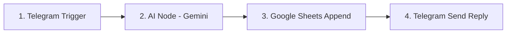

import { Aside } from "@astrojs/starlight/components";

<Aside title="💡 ရည်ရွယ်ချက်">
  Telegram Bot မှတစ်ဆင့် Customer မေးခွန်းများကို AI (Gemini) ဖြင့် နားလည်စေ၍ အဖြေထုတ်ခိုင်းခြင်း၊ အချက်အလက်များကို Google Sheets ထဲသို့ အလိုအလျောက် သိုလှောင်ခြင်းနှင့် Customer ထံသို့ စာပြန်ပို့ခြင်း အဆင့်များကို Code မရေးဘဲ လက်တွေ့ တည်ဆောက်သွားရန် ဖြစ်ပါတယ်။
</Aside>

## Workflow ရဲ့ လမ်းကြောင်း (Architecture)

ကျွန်ုပ်တို့ တည်ဆောက်မည့် Workflow တွင် Node ၄ ခုဖြင့် တည်ဆောက်ထားပါမည်:

---

## Step-by-Step တည်ဆောက်နည်း

### Step 1: Telegram Trigger ဖန်တီးခြင်း
1. n8n Canvas တွင် **Telegram Trigger** Node ကို ထည့်သွင်းပါ။
2. Telegram **@BotFather** ဆီမှ ရရှိလာသော `Bot Token` ကို Credential ထည့်ပါ။
3. Event ကို **Message** ဟု ရွေးပါ။ (ဒါဆိုရင် Customer မေးခွန်း ရောက်လာပါက Workflow ချက်ချင်း စတင်ပါမည်)။

### Step 2: AI Node (Google Gemini) ချိတ်ဆက်ခြင်း
1. Trigger ဘေးတွင် **Basic LLM Chain** သို့မဟုတ် **Google Gemini Chat Model** Node ကို ထည့်ပါ။
2. [Google AI Studio](https://aistudio.google.com) မှ ရရှိလာသော Gemini API Key ကို ထည့်သွင်းပါ။
3. **Model:** `gemini-2.5-flash` ကို ရွေးချယ်ပါ။
4. **Prompt Expression:** `{{ $json.message.text }}` (Customer မေးလာသော စာ) ကို ဆွဲထည့်ပါ။
5. **System Instructions:** 
   > "မင်းက ကျွန်တော်တို့ ဆိုင်ရဲ့ ဖော်ရွေတဲ့ Customer Support ပါ။ ဝင်လာတဲ့ မေးခွန်းကို ယဉ်ယဉ်ကျေးကျေးနဲ့ မြန်မာလို အတိုချုံး ပြန်ဖြေပေးပါ။"

### Step 3: Google Sheets တွင် Data မှတ်တမ်းတင်ခြင်း
1. AI Node ဘေးတွင် **Google Sheets** Node ကို ထည့်ပါ။
2. **Operation:** `Append Row`
3. Column Values များကို Expression ဖြင့် ညွှန်းဆိုပါ:
   - `Customer Name`: `{{ $json.message.from.first_name }}`
   - `Inquiry`: `{{ $json.message.text }}`
   - `AI Response`: `{{ $json.text }}`

### Step 4: Telegram မှတစ်ဆင့် Customer ထံ အဖြေ ပြန်လည် ပို့ဆောင်ခြင်း
1. **Telegram** (Action Node) ကို ထည့်ပါ။
2. **Operation:** `Send Message`
3. **Chat ID:** `{{ $json.message.chat.id }}`
4. **Text:** `{{ $json.text }}` (AI ထုတ်ပေးထားသော အဖြေ)

---

## Live Testing & Verification

1. n8n တွင် **Test Workflow** ခလုတ်ကို နှိပ်ပါ။
2. Telegram Bot ထံသို့ စာလှမ်းပို့ပါ (ဥပမာ - "ဆိုင်က ဘယ်အချိန် ပိတ်လဲခင်ဗျာ")။
3. **ရလဒ်:** 
   - Gemini မှ မေးခွန်းကို သုံးသပ်ပြီး အဖြေ ထုတ်ပေးမည်။
   - Google Sheets ထဲသို့ Row အသစ် ဝင်ရောက်မည်။
   - Telegram ထံသို့ AI ၏ အဖြေ စက္ကန့်ပိုင်းအတွင်း ပြန်ရောက်လာမည် ဖြစ်ပါတယ်။
