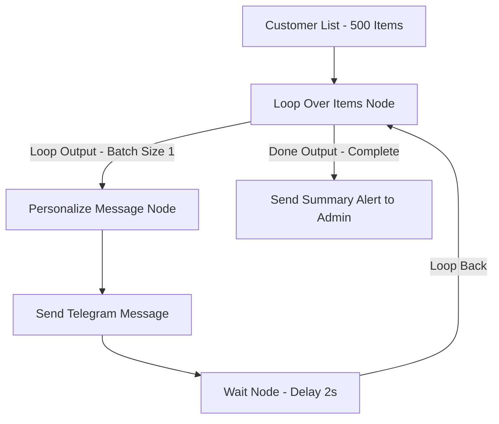

import { Aside } from "@astrojs/starlight/components";

<Aside title="💡 ရည်ရွယ်ချက်">
  Customer အရေအတွက် ရာနှင့်ချီသော Data မက်ဆေ့ချ် များကို Telegram / Email API ၏ Rate Limit (429 Error) မကျော်လွန်စေဘဲ **Loop Over Items** နှင့် **Wait Node** များ သုံး၍ အလိုအလျောက် သန့်ရှင်းစွာ ပို့ဆောင်ပေးနိုင်ရန် ဖြစ်ပါတယ်။
</Aside>

## ဘာကြောင့် Loop နှင့် Rate Limiting ကို သုံးရသလဲ?

Telegram API (တစ်စက္ကန့်လျှင် Max 30 messages) သို့မဟုတ် Gmail / SMS API များကို Customer List ၁၀၀၀ စာ Array တစ်ခုတည်းဖြင့် တစ်ပြိုင်နက်တည်း POST ပို့ပါက API မှ **429 Too Many Requests (Rate Limit Error)** ပြန်လည် ထုတ်ပေးမည် ဖြစ်ပါတယ်။

ထို့ကြောင့် Customer တစ်ယောက်ချင်းစီအလိုက် Data အပိုင်းလိုက် ခွဲခြား၍ စက္ကန့်အနည်းငယ် ခြားကာ ပို့ဆောင်ပေးမည့် **Looping & Rate Limiting System** ကို တည်ဆောက်ရပါမယ်။

---

## 1. Loop Over Items Node (Split in Batches)

### အဓိက Parameters များ:
- **Batch Size:** 
  - `1`: Customer တစ်ဦးချင်းစီအတွက် သီးသန့် Control ယူ၍ ပို့ခြင်း (အန္တရာယ် ကင်းဆုံးနှင့် Personalize အဆင်ပြေဆုံး)။
  - `50`: အုပ်စုလိုက် ပို့ခြင်း (မြန်ဆန်သော်လည်း Burst Rate Limit မမိစေရန် သတိပြုရမည်)။
- **Outputs:**
  - `loop` Output: Item တစ်ခုချင်းစီကို Process ပြုလုပ်ပြီးပါက Loop Over Items Node ထံသို့ **ပြန်လည် မြှား ချိတ်ဆက် (Loop Back)** ပေးရပါမည်။
  - `done` Output: Batch တစ်ခုလုံး ပြီးစီးသွားပါက နောက်ဆုံး Admin Alert ထံ သို့ သွားမည့် လမ်းကြောင်း ဖြစ်ပါတယ်။

---

## 2. Wait Node ဖြင့် Rate Limit ထိန်းချုပ်ခြင်း

Loop Output လမ်းကြောင်း ထဲတွင် **Wait Node** ကို ချိတ်ဆက်ပေးရပါမည်:

- **Resume Mode:** `After Time Interval`
- **Wait Amount:** `2 Seconds`

ဒါဆိုရင် မက်ဆေ့ချ် တစ်စောင် ပို့ပြီးတိုင်း ၂ စက္ကန့် အလိုအလျောက် နားပေးသွားမည် ဖြစ်သောကြောင့် Server မှ Spam Bot မဟုတ်ကြောင်း ယုံကြည်စိတ်ချစွာ လက်ခံသွားမည် ဖြစ်ပါတယ်။

---

## 3. 429 Error Handling (Automatic Backoff)

အကယ်၍ API မှ `429 Too Many Requests` တုံ့ပြန်လာပါက:

1. Node ၏ Settings တွင် `On Error: Continue Using Error Output` ထားပါ။
2. Error Output ထဲတွင် IF Node ဖြင့် Status Code `429` ဟု စစ်ဆေးပါ။
3. Status Code 429 ဖြစ်ပါက **Wait Node** ဖြင့် စက္ကန့်အနည်းငယ် (Exponential Backoff) ထပ်မံ နားပြီးမှ ထို Item ကို **Retry ပြန်လည် ပို့ဆောင်** စေပါ။
