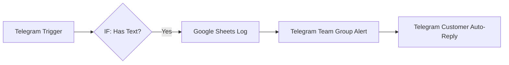

import { Aside } from "@astrojs/starlight/components";

<Aside title="💡 ရည်ရွယ်ချက်">
  မြန်မာနိုင်ငံရှိ e-Commerce / SME လုပ်ငန်းများ အဓိက အသုံးပြုသည့် **Telegram Bot** နှင့် n8n ကို တိုက်ရိုက် ချိတ်ဆက်၍ Customer Message များကို အလိုအလျောက် တုံ့ပြန်ခြင်း၊ Google Sheets တွင် Data Log သိမ်းဆည်းခြင်းနှင့် Team Alert ပို့ခြင်းများကို လက်တွေ့ တည်ဆောက်ရန် ဖြစ်ပါတယ်။
</Aside>

## ဘာကြောင့် Telegram ကို အဓိက သုံးသင့်သလဲ?

Telegram သည် Developer-friendly အဖြစ်ဆုံး Platform တစ်ခု ဖြစ်ပြီး:
- Meta App Review သို့မဟုတ် ရှုပ်ထွေးသော Setup များ လိုအပ်ခြင်း မရှိ။
- **@BotFather** မှတစ်ဆင့် မိနစ်ပိုင်းအတွင်း API Token ရရှိနိုင်ခြင်း။
- Customer များနှင့် မကြာမီ အချိန်အတွင်း (၁ နာရီအတွင်း) အလိုအလျောက် စနစ်ဖြင့် ဆက်သွယ် တုံ့ပြန်နိုင်ခြင်း။

---

## 1. Workflow A: Telegram Order & Inquiry Funnel

### Step 1: Telegram Bot ဖန်တီးခြင်း
1. Telegram တွင် **@BotFather** ထံ သို့ `/newbot` စာပို့၍ Bot Name နှင့် Username သတ်မှတ်ပါ။
2. ရရှိလာသော **API Token** ကို n8n Credential (Telegram API) တွင် ထည့်သွင်းပါ။

### Step 2: n8n Workflow ချိတ်ဆက်ခြင်း
1. **Telegram Trigger Node:** Event ကို `message` သတ်မှတ်ပါ။
2. **IF Node (Validation):** `{{ $json.message?.text }}` ရှိမရှိ စစ်ဆေးပါ (Text မဟုတ်သော Photo, Sticker များကို Error မတက်စေရန်)။
3. **Google Sheets (Append Row):** Time, Customer Name, Message, Phone Number များကို စနစ်တကျ Log သိုလှောင်ပါ။
4. **Telegram (Send Message):** Team Group ထံသို့ `📩 Message အသစ် ဝင်ရောက်ပါသည်` ဟု Alert ပို့ပါ။
5. **Telegram (Auto-Reply):** Customer ရဲ့ Chat ID သို့ `မင်္ဂလာပါခင်ဗျာ၊ သင့်မက်ဆေ့ချ်ကို လက်ခံရရှိပါပြီ။` ဟု စက္ကန့်ပိုင်းအတွင်း ပြန်ပို့ပါ။

---

## 2. Workflow B: Gmail Order Email → Telegram Forwarding

Gmail ထံသို့ ဝင်ရောက်လာသော အရေးကြီး အော်ဒါ Email သို့မဟုတ် Payment Confirmation စာများကို Team Telegram Group သို့ အလိုအလျောက် Forward လုပ်ပေးသည့် Workflow:

1. **Gmail Trigger:** Label = `IMPORTANT` သို့မဟုတ် Filter = `Order Confirmation`
2. **IF Node:** Amount သို့မဟုတ် Customer Type ကို စစ်ဆေးခြင်း။
3. **Telegram Node:** Team Group ထံသို့ Email Subject နှင့် Content ကို Telegram Message အဖြစ် Forward လုပ်ခြင်း။

---

## 3. Workflow C: Scheduled Daily Sales Report

နေ့စဉ် မနက် ၉ နာရီတိုင်း မနေ့က အရောင်းစာရင်းများကို Telegram Group သို့ Report ထုတ်ပေးခြင်း:

1. **Schedule Trigger:** Cron `0 9 * * 1-5` (တနင်္လာ မှ သောကြာ၊ မနက် ၉ နာရီ)
2. **Google Sheets / Database Node:** မနေ့က Sales Data များကို Select/Read ပြုလုပ်ပါ။
3. **Set Node:** Total Revenue နှင့် Total Orders များကို တွက်ချက်ပါ။
4. **Telegram Node:** Team Group ထံသို့ HTML Formatted Message ဖြင့် `📊 Daily Sales Summary Report` အလိုအလျောက် ပို့ပေးပါ။
