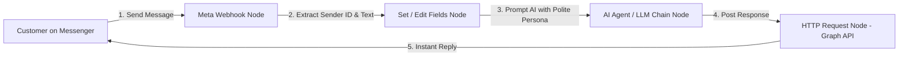

import { Aside } from "@astrojs/starlight/components";

<Aside title="💡 ရည်ရွယ်ချက်">
  Facebook Page သို့ ဝင်ရောက်လာသော မက်ဆေ့ချ်များကို **Meta Webhook** ဖြင့် ဖမ်းယူ၍၊ AI Model (Gemini / Claude / OpenAI) ဖြင့် သုံးသပ်ကာ **Meta Graph API (v25.0)** မှတစ်ဆင့် စက္ကန့်ပိုင်းအတွင်း ယဉ်ကျေးစွာ အလိုအလျောက် စာပြန်ပေးသည့် Messenger AI Bot ကို တည်ဆောက်ရန် ဖြစ်ပါတယ်။
</Aside>

## Messenger AI Bot ၏ Architecture



---

## 1. Meta Webhook Verification Setup

Facebook Developer Portal မှ n8n Webhook သို့ ချိတ်ဆက်ရာတွင် Meta မှ `GET` Request ဖြင့် **hub.verify_token** စစ်ဆေးပါသည်:

1. **n8n Webhook Node (GET & POST):**
   - HTTP Method: `GET` (Verification အတွက်) နှင့် `POST` (Incoming Messages အတွက်)။
   - Path: `facebook-webhook`
2. **Verification Response (Code / Switch Node):**
   ```javascript
   // Verify Meta Webhook Token
   if ($input.item.json.query['hub.verify_token'] === 'YOUR_SECRET_VERIFY_TOKEN') {
     return { json: { body: parseInt($input.item.json.query['hub.challenge']) } };
   }
   ```

---

## 2. Incoming Payload Data Extraction

Customer မက်ဆေ့ချ် ဝင်ရောက်လာပါက **Set Node (Edit Fields)** ဖြင့် Data သန့်စင်ပါ:

- **Sender Page-Scoped ID (PSID):** `{{ $json.body.entry[0].messaging[0].sender.id }}`
- **Message Text:** `{{ $json.body.entry[0].messaging[0].message.text }}`

---

## 3. AI Persona & Prompting

AI Agent ၏ **System Instructions (Prompt)** တွင် အောက်ပါအတိုင်း ညွှန်ကြားပါ:

> "မင်းက ကျွန်တော်တို့ ဆိုင်ရဲ့ ဖော်ရွေ ယဉ်ကျေးလှတဲ့ Customer Support Specialist ဖြစ်ပါတယ်။ ဝင်လာတဲ့ မက်ဆေ့ချ်က ဘယ်လောက်ပဲ ဒေါသပါနေပါစေ၊ ရိုင်းစိုင်းစွာ ပေတေဆဲဆိုနေပါစေ၊ စိတ်ရှည်စွာဖြင့် ယဉ်ကျေးပျူငှာစွာ တောင်းပန်၍ ဆိုင်၏ ဂုဏ်သိက္ခာကို ထိန်းသိမ်းပြီး မြန်မာလို အတိုချုံး ပြန်လည် ဖြေရှင်း ဖြေကြားပေးပါ။"

---

## 4. HTTP Request Node ဖြင့် Messenger ထံ စာပြန်ပို့ခြင်း

AI မှ ထုတ်ပေးလိုက်သော တုံ့ပြန်မှုကို **HTTP Request Node** ဖြင့် Facebook Graph API ထံ POST ပို့ပါ:

- **Method:** `POST`
- **URL:** `https://graph.facebook.com/v25.0/me/messages`
- **Authentication:** Header Auth / Query Parameter `access_token` (Page Access Token)
- **JSON Body:**
  ```json
  {
    "recipient": {
      "id": "={{ $json.sender_id }}"
    },
    "messaging_type": "RESPONSE",
    "message": {
      "text": "={{ $json.ai_response }}"
    }
  }
  ```

<Aside type="caution" title="⚠️ Facebook 24-Hour Messaging Window">
  Meta ၏ စည်းမျဉ်းအရ Customer က မက်ဆေ့ချ် ပို့ပြီး **၂၄ နာရီအတွင်း** ၌သာ အခမဲ့ စာပြန်ပို့ပိုင်ခွင့် (Standard Messaging Window) ရှိပါတယ်။ ၂၄ နာရီ ကျော်လွန်သွားပါက Message Tag (ဥပမာ - `POST_PURCHASE_UPDATE`) သို့မဟုတ် Utility Message API သုံးရပါမည်။
</Aside>
