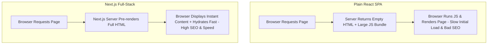

import { Aside } from "@astrojs/starlight/components";

<Aside title="💡 ရည်ရွယ်ချက်">
  Modern Web Development တွင် လူကြိုက်အများဆုံး Full-Stack React Framework ဖြစ်သည့် **Next.js** ၏ အခြေခံ သဘောတရားများနှင့် Vite / Plain React တို့ထက် သာလွန်သော အချက်များကို နားလည်စေရန် ဖြစ်ပါတယ်။
</Aside>

## React သက်သက် (Vite) vs. Next.js Full-Stack

Plain React (Vite/CRA) သည် **Single Page Application (SPA)** ရေးဆွဲရန်အတွက် Client-side UI Library တစ်ခုသာ ဖြစ်ပါတယ်။



---

## Next.js ရဲ့ အဓိက အားသာချက် ၅ ခု

1. **Server-Side Rendering (SSR) & Static Site Generation (SSG):** Page များကို Server ဘက်တွင် Pre-render လုပ်ပေးသဖြင့် **SEO အလွန် ကောင်းမွန်ခြင်း** နှင့် Initial Load Speed မြန်ဆန်ခြင်း။
2. **App Router File-System Routing:** Folder Structure ကို အခြေခံ၍ Nested Routes, Layouts နှင့် Shared Templates များကို အလိုအလျောက် သတ်မှတ်ပေးခြင်း။
3. **Full-Stack Capabilities:** Separate Backend API မလိုအပ်ဘဲ Route Handlers (`api/route.ts`) နှင့် **Server Actions** များကို တိုက်ရိုက် ရေးသားနိုင်ခြင်း။
4. **Built-in Image & Font Optimization:** `<Image />` Component ဖြင့် ပုံများကို WebP Format သို့ အလိုအလျောက် ပြောင်းလဲခြင်းနှင့် Google Fonts များကို Zero-layout-shift ဖြစ်အောင် သိုလှောင်ပေးခြင်း။
5. **Zero Config Production Setup:** TypeScript, TailwindCSS, ESLint နှင့် SWC Compiler တို့ကို အသင့်ပါဝင်ပြီးဖြစ်၍ Setup ပြုလုပ်ရ လွယ်ကူခြင်း။

---

## Next.js App စတင် ဖန်တီးနည်း (`create-next-app`)

Terminal တွင် Command တစ်ကြောင်းတည်း ရိုက်နှိပ်၍ Project အသစ် စတင်နိုင်ပါတယ်:

```bash
npx create-next-app@latest my-next-app \
  --typescript \
  --tailwind \
  --eslint \
  --app \
  --src-dir \
  --import-alias "@/*"
```
