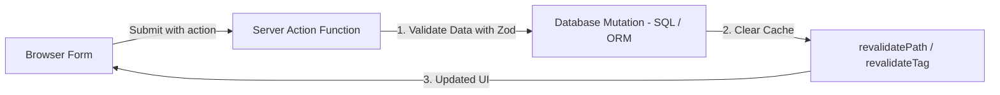

import { Aside } from "@astrojs/starlight/components";

<Aside title="💡 ရည်ရွယ်ချက်">
  API Route များ သီးသန့် ရေးစရာ မလိုဘဲ Form Submission နှင့် Data Mutations များကို Server ပေါ်တွင် တိုက်ရိုက် လုံခြုံစွာ လုပ်ဆောင်ပေးသည့် **Server Actions** သဘောတရားကို လေ့လာသွားရန် ဖြစ်ပါတယ်။
</Aside>

## Server Actions ဆိုတာ ဘာလဲ?

**Server Actions** ဆိုသည်မှာ Server ပေါ်တွင် အလုပ်လုပ်သော `async` Function များ ဖြစ်ပြီး၊ Client Component သို့မဟုတ် ရိုးရိုး `<form>` ၏ `action` attribute မှတစ်ဆင့် တိုက်ရိုက် လှမ်းခေါ် စေခိုင်းနိုင်သော နည်းပညာ ဖြစ်ပါတယ်။



---

## 1. Server Action ရေးသားနည်း ဥပမာ

`'use server'` directive ကို သုံး၍ Action ဖန်တီးပါမည်:

```typescript
// app/actions/create-post.ts
"use server";

import { revalidatePath } from "next/cache";

export async function createPost(formData: FormData) {
  const title = formData.get("title") as string;
  const content = formData.get("content") as string;

  // 1. Database တွင် Data ရေးသွင်းခြင်း (Prisma / SQL)
  await db.post.create({
    data: { title, content },
  });

  // 2. Cache Invalidation ( UI ကို အလိုအလျောက် Update ဖြစ်စေရန်)
  revalidatePath("/posts");
}
```

---

## 2. HTML `<form>` တွင် Server Action ကို တိုက်ရိုက် သုံးစွဲခြင်း

Progressive Enhancement ရရှိသဖြင့် JavaScript ပိတ်ထားလျှင်ပင် Form Submission အလုပ်လုပ်ပါသည်:

```tsx
// app/posts/new/page.tsx
import { createPost } from "@/app/actions/create-post";

export default function NewPostPage() {
  return (
    <form action={createPost} className="flex flex-col gap-4 max-w-md">
      <input
        type="text"
        name="title"
        placeholder="Post Title"
        required
        className="border p-2 rounded"
      />
      <textarea
        name="content"
        placeholder="Post Content"
        required
        className="border p-2 rounded"
      />
      <button type="submit" className="bg-blue-600 text-white p-2 rounded">
        Create Post
      </button>
    </form>
  );
}
```

---

## 3. Pending State & Action Feedback (`useActionState`)

Form Submit ပြုလုပ်စဉ် Loading Spinner အသုံးပြုလိုပါက React ၏ `useActionState` Hook ဖြင့် သုံးစွဲနိုင်ပါတယ်:

```tsx
"use client";

import { useActionState } from "react";
import { createPost } from "@/app/actions/create-post";

export default function PostForm() {
  const [state, formAction, isPending] = useActionState(createPost, null);

  return (
    <form action={formAction}>
      <input name="title" required />
      <button type="submit" disabled={isPending}>
        {isPending ? "Creating..." : "Submit"}
      </button>
    </form>
  );
}
```
