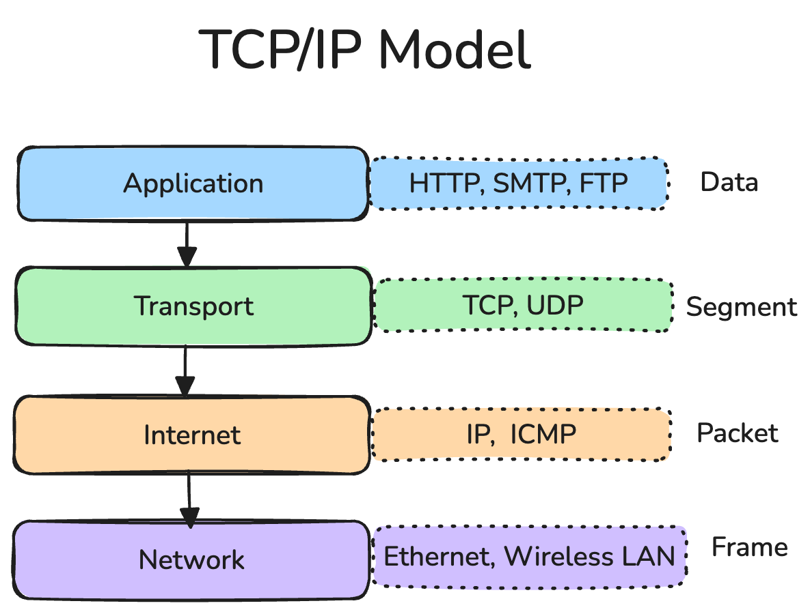

### TCP (Transmission Control Protocol) ဆိုတာ ဘာလဲ?

အင်တာနက်ပေါ်မှာ အချက်အလက် (Data) တွေ ပို့တယ်ဆိုတာ အဆင့်ဆင့် စည်းမျဉ်းတွေ (Protocol Layer တွေ) နဲ့ သွားတာပါ။ စာပို့တာနဲ့ ဆင်တူပါတယ်။ TCP ရဲ့ အဓိက အလုပ်ကတော့ အချက်အလက်တွေကို ပို့တဲ့နေရာကနေ လက်ခံတဲ့နေရာဆီကို ယုံကြည်စိတ်ချရတဲ့ နည်းလမ်းနဲ့ ပို့ဆောင်ပေးတာပဲ ဖြစ်ပါတယ်။

### TCP ရဲ့ အဓိက ကောင်းကွက်များ။

#### Connection-Oriented

TCP ဟာ "ဆက်သွယ်မှု ထူထောင်ပြီးမှ သွားတဲ့" (Connection-Oriented) နည်းလမ်းပါ။ ဒါက ဘာကိုပြောလဲဆိုတော့ တကယ် အချက်အလက် မပို့ခင်မှာ ပို့မယ့် ကွန်ပျူတာနှစ်လုံး (ပို့သူနဲ့ လက်ခံသူ) ကြားမှာ 'ငါတို့ အဆက်အသွယ်ရပြီနော်၊ အချက်အလက်တွေ ပို့တော့မယ်နော်' ဆိုပြီး လမ်းကြောင်းတစ်ခုကို အရင် ဖွင့်လိုက်ရပါတယ်။ အချက်အလက် အားလုံး ပို့ပြီးသွားရင်လည်း 'ပို့လို့ပြီးပြီ' ဆိုပြီး စနစ်တကျ ပြန်ပိတ်ရပါတယ်။ ဒါဟာ မပြောချင်တဲ့အချိန် ဖုန်းမခေါ်ဘဲ၊ ပြောချင်မှ ဖုန်းခေါ်ပြီး ပြောတာနဲ့ တူပါတယ်။

    

#### TCP ဟာ "ယုံကြည်စိတ်ချရတယ်" (Reliable)။

ပို့လိုက်တဲ့ အချက်အလက်တွေ လမ်းမှာ ပျောက်ဆုံးတာ၊ မလိုလားဘဲ နှစ်ခါရောက်တာ၊ ဒါမှမဟုတ် ရှေ့နောက်လွဲပြီး ရောက်တာမျိုးတွေ မဖြစ်အောင် သေချာ စီစဉ်ပေးပါတယ်။ Registered Mail စာတိုက်ကနေ အာမခံနဲ့ ပို့တာမျိုးနဲ့ ဆင်ပါတယ်။

### ဘယ်လို ယုံကြည်စိတ်ချရအောင် လုပ်ဆောင်လဲ?

- **အစီအစဉ် နံပါတ်တပ်ခြင်း (Sequence Numbers)**: ပို့လိုက်တဲ့ အချက်အလက် အပိုင်းလေးတွေကို အစီအစဉ်လိုက် နံပါတ်တွေ တပ်ပေးလိုက်တယ်။ ဒါမှ လက်ခံရတဲ့သူက နံပါတ်အတိုင်း ပြန်စီပြီး မူရင်းအတိုင်း ရနိုင်တာပေါ့။ (စာရွက်တွေကို နံပါတ်တပ်ပြီး ပို့သလိုပါပဲ)
- **လက်ခံကြောင်း အကြောင်းပြန်ခြင်း (Acknowledgements - ACKs)**: အချက်အလက် အပိုင်းလေးတစ်ခုကို အောင်မြင်စွာ လက်ခံရရှိပြီဆိုတာနဲ့ လက်ခံတဲ့ဘက်က ပို့တဲ့သူကို 'ရပါပြီ' လို့ ပြန်ပြီး အကြောင်းကြားပေးတယ်။ (ပစ္စည်းရတာနဲ့ လက်ခံရရှိကြောင်း ပြန်စာထိုးပေးတာမျိုး)
- **ပြန်ပို့ခြင်း (Retransmission)**: ပို့တဲ့သူက အပိုင်းတစ်ခုကို ပို့လိုက်ပြီး လက်ခံရရှိကြောင်း အကြောင်းပြန်စာ (ACK) ကို အချိန်အတွင်း ပြန်မရရင် အဲဒီအပိုင်း ပျောက်သွားပြီ ထင်ပြီး အလိုအလျောက် ပြန်ပို့ပေးတယ်။
- **မှန်ကန်တဲ့ အစီအစဉ်အတိုင်း ရောက်ရှိခြင်း (Ordered Delivery)**: Data အပိုင်းလေးတွေ Network လမ်းကြောင်းပေါ်မှာ အစီအစဉ်လွဲပြီး ရောက်လာခဲ့ရင်တောင် TCP က အစီအစဉ် မှန်ကန်အောင် ပြန်စီပြီးမှ အပေါ်က Program တွေကို လွှဲပေးပါတယ်။ ပို့လိုက်တဲ့ အစီအစဉ်အတိုင်းပဲ လက်ခံသူဆီကို ရောက်ရှိစေပါတယ်။

### အခြား အရေးကြီး Feature များ။

- **ပို့တဲ့နှုန်း ထိန်းချုပ်ခြင်း (Flow Control)**: လက်ခံတဲ့ ကွန်ပျူတာရဲ့ မှတ်ဉာဏ် (Buffer) ပြည့်လျှံပြီး Data တွေ ပျောက်မသွားအောင် ပို့တဲ့ဘက်က Data ပို့တဲ့နှုန်းကို ထိန်းညှိပေးတယ်။ (ဥပမာ - ရေပိုက် အသေးလေးထဲကို ရေအများကြီး တန်းလောင်းထည့်ရင် ဖိတ်ကုန်သလိုမျိုး မဖြစ်အောင် ဖြည်းဖြည်းချင်း လောင်းထည့်တာမျိုး)
- **လမ်းကြောင်းပိတ်ဆို့မှု ထိချုပ်ခြင်း (Congestion Control)**: Network ပေါ်မှာ အချက်အလက် အသွားအလာ အရမ်းများပြီး လမ်းကြောင်းတွေ ပိတ်ဆို့မှု (Traffic Jam) မဖြစ်ရအောင် ကူညီပေးတဲ့ စနစ်တွေလည်း ပါဝင်ပါတယ်။
