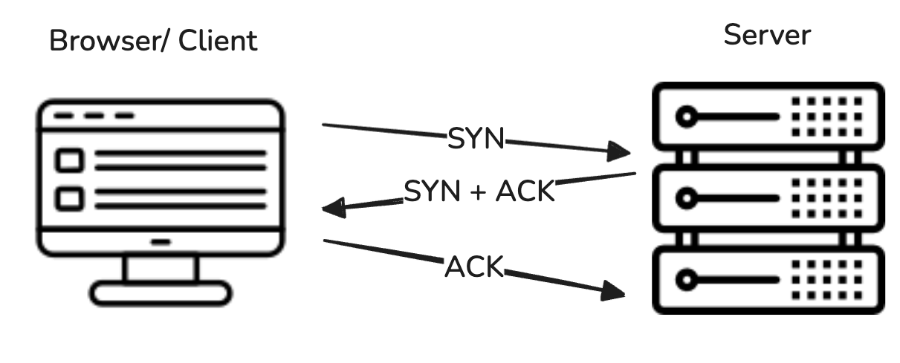

### 3-way Handshake

TCP ချိတ်ဆက်မှုတစ်ခုကို အစပြုဖို့အတွက် ကွန်ပျူတာနှစ်လုံး (ဥပမာ - ကိုယ့်ကွန်ပျူတာ/ဖုန်း နဲ့ Website Server) ကြားမှာ အဆင့် ၃ ဆင့်ပါတဲ့ "လက်ဆွဲနှုတ်ဆက်ခြင်း" လိုမျိုး အသိအမှတ်ပြုတဲ့ လုပ်ငန်းစဉ်လေးတစ်ခု လုပ်ရပါတယ်။ ဒါကို "၃ လမ်းသွား လက်ဆွဲနှုတ်ဆက်ခြင်း (3-way Handshake)" လို့ ခေါ်ပါတယ်။ ရိုးရှင်းစွာပြောရရင်တော့ အချက်အလက်မပို့ခင် နှစ်ဦးနှစ်ဖက် အဆင်သင့်ဖြစ်ကြောင်း သေချာအောင်လုပ်တာပါ။

### ဘာကြောင့် လုပ်ဆောင်ရသလဲ

ဒီ ၃ ဆင့် ပြီးသွားတာနဲ့ ကွန်ပျူတာနှစ်လုံးကြား TCP ချိတ်ဆက်မှု အောင်မြင်စွာ ထူထောင်ပြီး ဖြစ်သွားပါပြီ။ ဒါမှ နောက်ပိုင်း အချက်အလက်တွေကို ယုံကြည်စိတ်ချစွာ အပြန်အလှန် ပို့လို့ရတော့မှာ ဖြစ်ပါတယ်။ ဒီလို Handshake လုပ်တာက အချက်အလက်တွေ မပို့ခင် နှစ်ဘက်စလုံး အဆင်သင့်ဖြစ်ပြီလား၊ ဆက်သွယ်လို့ရပြီလားဆိုတာ သေချာအောင် လုပ်တာဖြစ်ပြီး၊ TCP ရဲ့ ယုံကြည်စိတ်ချရတယ်ဆိုတာ ဒီအချက်တွေကြောင့် ဖြစ်ပါတယ်။

### အဆင့်များ (Steps):

- #### အဆင့် ၁: SYN (Client မှ Server သို့)

  - Client ဘက် (ကိုယ့်ကွန်ပျူတာ/ဖုန်း) ကနေ Server ဆီကို 'ဟိုင်း... ငါ မင်းနဲ့ ဆက်သွယ်ပြီး အချက်အလက်တွေ ပို့ချင်ပါတယ်' လို့ ပြောတဲ့ သတင်းစကားလေး (SYN Packet လို့ခေါ်ပါတယ်) တစ်ခုကို အရင်ဆုံး ပို့လိုက်ပါတယ်။ ပို့တဲ့အခါမှာ နောက်ပိုင်းပို့မယ့် အချက်အလက်တွေကို ဘယ်ကနေ စပြီး နံပါတ်တပ်မယ်ဆိုတဲ့ ကိုယ့်ဘက်က အစပြုမယ့် နံပါတ်လေး (Initial Sequence Number - ISN လို့ခေါ်ပါတယ်) တစ်ခုကိုလည်း ထည့်ပေးလိုက်ပါတယ်။ (ဒီ နံပါတ်က နောက်ပိုင်း အချက်အလက်တွေ အစီအစဉ် မှန်/မမှန် စစ်ဖို့အတွက် အရေးကြီးပါတယ်)

- #### အဆင့် ၂: SYN-ACK (Server မှ Client သို့)

  - Server က Client ပို့လိုက်တဲ့ SYN သတင်းစကားကို ရပြီဆိုတာနဲ့ 'အိုကေ... မင်းရဲ့ ဆက်သွယ်ချင်တဲ့ သတင်းစကားကို ငါ ရပြီ' လို့ အသိအမှတ်ပြုတဲ့ အကြောင်းပြန်စာ (ACK) တစ်ခု Client ဆီ ပြန်ပို့ပါတယ်။ ဒီလိုပြန်ပို့ရင်းနဲ့ တစ်ချိန်တည်းမှာပဲ Server ကလည်း 'ငါလည်း မင်းနဲ့ ဆက်သွယ်ဖို့ အဆင်သင့်ပဲ' ဆိုတဲ့ သူ့ရဲ့ SYN သတင်းစကားနဲ့ သူကနေ စတင်မယ့် ကိုယ်ပိုင်နံပါတ် (ISN) ကိုပါ ပေါင်းပြီး Client ဆီ ပြန်ပို့ပေးပါတယ်။

- #### အဆင့် ၃: ACK (Client မှ Server သို့)

  - Client က Server ပို့လိုက်တဲ့ SYN-ACK သတင်းစကားကို ရပြီဆိုတာနဲ့ 'ကောင်းပြီ... မင်းရဲ့ ဆက်သွယ်ဖို့ အဆင်သင့်ဖြစ်ပြီဆိုတဲ့ သတင်းစကားကို ငါ ရပြီ။ ကဲ... စကားစပြောလို့ ရပြီ' လို့ အတည်ပြုတဲ့ နောက်ဆုံး အကြောင်းပြန်စာလေး (ACK) တစ်ခုကို Server ဆီကို ပြန်ပို့လိုက်ပါတယ်။
